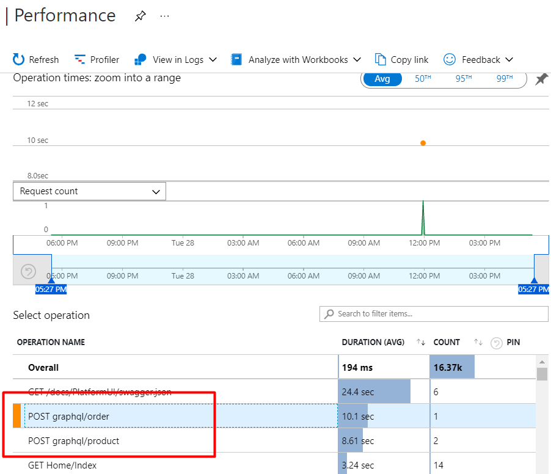
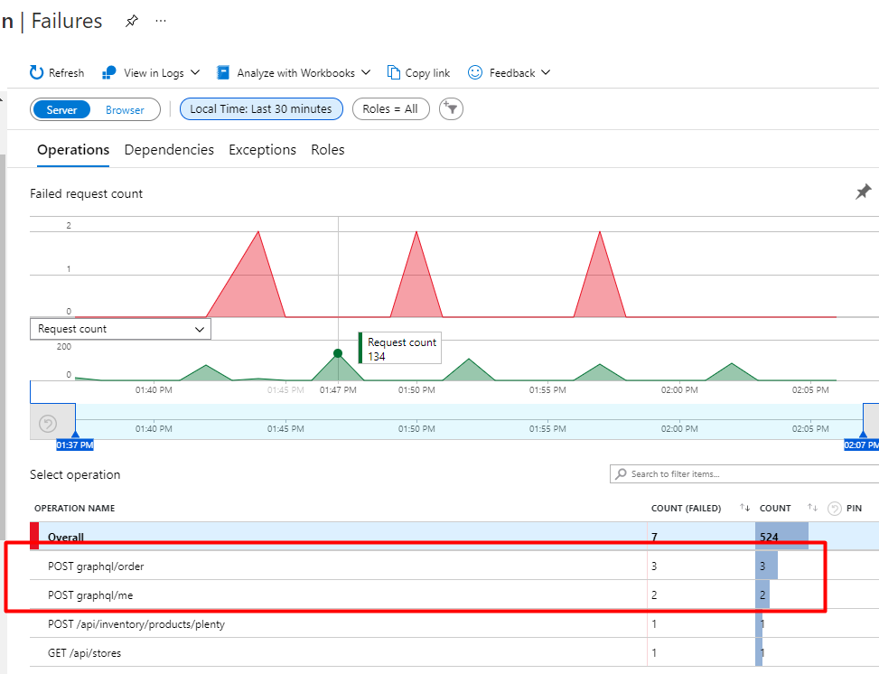
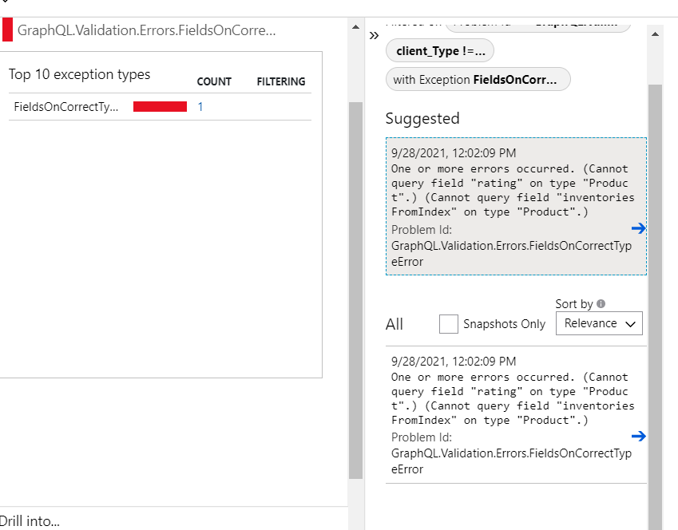
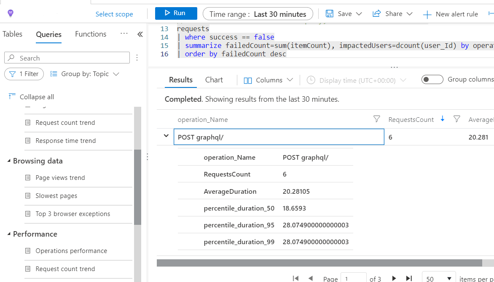

# Troubleshooting

By default all GraphQL requests are sent via HTTP `POST /graphql` endpoind method and all the information about the request is included in the POST request body, therefore the ability to see in Application Insights what query or mutation was executed is lost.

By [overriding](https://github.com/VirtoCommerce/vc-module-experience-api/blob/dev/src/VirtoCommerce.ExperienceApiModule.Core/Infrastructure/CustomGraphQLExecuter.cs) the default GraphQL executor we can send our custom telemetry to Application Insights and see what mutation or query was executed and what errors, if any, were handled by GraphQL.

**1. General list of requests can be seen in the Performance tab:**

**2. Information about failed requests and associated Exceptions can be found in Failures tab:**

**3. Application Insights query mechanism:**

