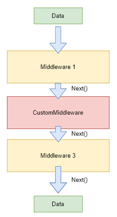

# How to extend
The xAPI provides default GraphQL schemas for types,  queries, and mutations. However, each project has its unique requirements, and we can’t foresee all of them and include into the base schema, but thanks to extensions points that the xAPI provides you can change the baseline behavior and data structures. On this article are described the main extension points and techniques that you can use in your custom projects.

At the moment the xAPI project has the following main extensions points in addition to the extension points that platform provides [extensibility overview](https://virtocommerce.com/docs/latest/fundamentals/extensibility/overview/)

Note: *However, unfortunately, there is no opportunity to extend AutoMapper's profiles using AbstractTypeFactory<> type.*

[Sample code](https://github.com/VirtoCommerce/vc-module-experience-api/tree/dev/samples/VirtoCommerce.Exp.ExtensionSamples)

## Extend the root GraphQL schema
Since  the  `graphql-dotnet` is supported the both schema definition `schema-first-approach` and `graphtype-first-approach` in the xAPI we stayed only on the `graphtype-first-approach` because it more naturally to .NET developers and  gives you access to all of the provided properties of your GraphType's and Schema also this approach is better to suit the extension model via type overrides.

In order to register a new query or mutation you need to derive the custom schema type from `ISchemaBuilder`.  `ISchemaBuilder` – interface is intended for dynamic adding the new queries into the root GraphQL schema query, so that for register a new query you need to define a new type that implements this interface  and register  it in the DI. The multiple `ISchemaBuilder` instances will be used to add the queries into root schema in first time when application start.

Here an example how to define schema types for existing domain types. On this example we define the new GraphQL schema  object type - `InventoryType` for underlying domain type `Inventory` from the  `inventory module`.

*CustomSchema.cs*
```csharp
 public class CustomSchema : ISchemaBuilder
    {
        public void Build(ISchema schema)
        {
            var inventoryQueryField = new FieldType
            {
                Name = "inventory",
                Arguments = new QueryArguments(
                     new QueryArgument<NonNullGraphType<StringGraphType>> { Name = "id" },
                 ),
                Type = typeof(InventoryType),
                Resolver = new  FieldResolver<Inventory>(context =>
                {
                    return new Inventory { ProductId = "1", FulfillmentCenterId = "center1" };
                })
            };
            schema.Query.AddField(inventoryQueryField);
        }
    }
```

*module.cs*
```csharp
 public class Module : IModule
 {
    public void Initialize(IServiceCollection services)
    {
        //Register custom schema
        services.AddSchemaBuilder<CustomSchema>();
    }
 }
```

## Extend the existing schema type with new properties

To extend the existing GraphQL type you need to do the following steps

Derive your schema type from the existing one that you want to extend

*CartType2.cs*
```csharp
  public class CartType2 : CartType
    {
        public CartType2(ICartAvailMethodsService cartAvailMethods) : base(cartAvailMethods)
        {
            Field<StringGraphType>("myCoolScalarProperty", resolve: context => "my cool value" );
        }
    }
```

Register your override with the special syntax in the `module.cs`.

*module.cs*
```csharp
 public class Module : IModule
 {
    public void Initialize(IServiceCollection services)
    {
        //GraphQL schema overrides
        services.AddSchemaType<CartType2>().OverrideType<CartType, CartType2>();
    }
 }
```
## Extend validation logic / replace validators
The system uses Platform's abstract type factory to instantiate validators. Therefore the approach of validation logic extension similar to other cases (such as domain model extension):
- Derive your custom validator from original one:

*CartValidator2.cs*
```csharp
    public class CartValidator2 : CartValidator
    {
        public CartValidator2()
        {
            // Some additional rules (to the basic) can be provided there
            RuleFor(x => x.CartAggregate.Cart.Id).NotEmpty(); // Just example
        }
    }
```
- Override original validator type with your custom in order to tell the factory CartValidator2 replaces the original validator:

*module.cs*
```csharp
    public class Module : IModule
    {
        public void PostInitialize(IApplicationBuilder appBuilder)
        {
            ...
            // Example: replace cart validator
            AbstractTypeFactory<CartValidator>.OverrideType<CartValidator, CartValidator2>();
            ...
        }
    }
```


## Generic behavior pipelines
xAPI extension points are not limited to data structure extensions. You can also change behavior and business logic outside from  the your custom module without touching the original source code.

*Generic behavior pipelines* - is primarily intended to split the complex logic into multiple lousily coupled stages (middleware) that can be define on the different places and  that are combined into one logical pipeline that can executed for some system events of requests.



You can extend the existing generic pipelines with you own middlewares or even replace an existing to your custom version.

Consider the example when you want to replace the existing generic pipeline that is called to enrich the `ProductSearchResult` with the data for pricing and availability from different data sources.

```csharp
 //the generic pipeline that is used  for on-the-fly additional data evaluation (prices, inventories, discounts and taxes) for resulting products
services.AddPipeline<SearchProductResponse>(builder =>
{
    builder.AddMiddleware(typeof(EvalProductsPricesMiddleware));
    builder.AddMiddleware(typeof(EvalProductsDiscountsMiddleware));
    builder.AddMiddleware(typeof(EvalProductsTaxMiddleware));
    builder.AddMiddleware(typeof(EvalProductsInventoryMiddleware));
});
```

First we need to define the new middleware

*MyCoolMiddleware.cs*

```csharp
public class MyCoolMiddleware : IAsyncMiddleware<SearchProductResponse>
{
    //code skipped for better clarity
}
```

The last step is register it for the generic behavior pipeline

*module.cs*

```csharp
 public class Module : IModule
 {
    public void Initialize(IServiceCollection services)
    {
           services.AddPipeline<SearchProductResponse>(builder =>
           {
                builder.AddMiddleware(typeof(MyCoolMiddleware));
           });
    }
 }
```

To replace the existing middleware to new one need to use the following syntax

 ```csharp
  services.AddPipeline<SearchProductResponse>(builder =>
            {
                builder.ReplaceMiddleware(typeof(EvalProductsTaxMiddleware), typeof(MyCoolMiddleware));
                //this line replaced the EvalProductsTaxMiddleware with the MyCoolMiddleware for GenericPipeline<SearchProductResponse>
            });
 ```

## Command/Query handlers replacement

xAPI is built with using the clean architecture based on CQRS and DDD principles, where each command and query has it's own handler that is responsible for handling and processing incoming actions, you can easy override and substitute any existing handler with your own implementation thereby changing the default behavior.

To do this, it is just enough to replace the required handler in the DI container with your own implementation.

```csharp
 public class Module : IModule
 {
    public void Initialize(IServiceCollection services)
    {
        //use such lines to override exists query or command handler
        services.AddTransient<IRequestHandler<GetCartQuery, CartAggregate>, CustomGetCartQueryHandler>();
    }
 }
```

To replace an existing command with your own implementation first register and override of your Input type

*module.cs*
```csharp
services.AddSchemaType<InputRemoveCartType2>().OverrideType<InputRemoveCartType, InputRemoveCartType2>();
```

And then regiser your implementations of Command and Handler like this

*module.cs*
```csharp
services.OverrideCommandType<RemoveCartCommand, RemoveCartCommandExtended>().WithCommandHandler<RemoveCartCommandHandlerExtended>();
```
