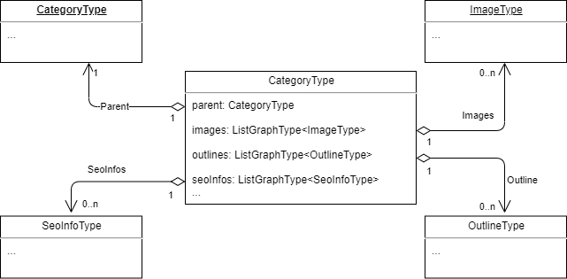

# X-Digital-Catalog provides high performance search queries for catalog data directly from search index engine

## X-Digital-Catalog key features:
- Full-text search ([→](#full-text-search))
- Fuzzy search ([→](#fuzzy-search))
- Filters syntax ([↪](filters-and-facets.md#filters))
- Filter by category subtree ([→](#filter-by-category))
- Filter by price ([→](#filter-by-price))
- Filter by custom properties ([→](#filter-by-custom-properties))
- Filter by products availability ([→](#filter-by-product-availability))
- Facets ([↪](filters-and-facets.md#facets))
- Multi-select faceting search ([→](#muti-select-faceting-search))

## How to use
Read this [article...](./how-to-use.md)

## Structure
### ProductType

#### Schema fields:
|№ |Name             |Type                                 |Description|
|--|-----------------|-------------------------------------|-----------|
| 1|id               |StringGraphType                      |The unique ID of the product|
| 2|code             |StringGraphType                      |The product SKU|
| 3|catalogId        |StringGraphType                      |CatalogId of the product|
| 4|category         |[CategoryType](#categorytype) |Field to resolve category of the requested product|
| 5|name             |StringGraphType                      |Name of the product|
| 6|descriptions     |List of DesciptionType               |Reviews of product|
| 7|productType      |StringGraphType                      |The type of product|
| 8|slug             |StringGraphType                      |Url of the product|
| 9|metaDescription  |StringGraphType                      |Meta description of the product|
|10|metaKeywords     |StringGraphType                      |Meta keywords of the product|
|11|metaTitle        |StringGraphType                      |Meta title of the product|
|12|imgSrc           |StringGraphType                      |Main image of the product|
|13|outerId          |StringGraphType                      |Category outer Id|
|14|brandName        |StringGraphType                      |Brand name of the product|
|15|masterVariation  |VariationType                        |Main variation of the product|
|16|variations       |List of VariationType                |Product variations|
|17|availabilityData |AvailabilityDataType                 |Product availability information|
|18|images           |List of ImageType                    |Product images|
|19|prices           |List of PriceType                    |Product prices|
|20|properties       |List of PropertyType                 |Product properties|
|21|assets           |List of AssetType                    |Product assets|
|22|outlines         |List of OutlineType                  |Category outlines|
|23|seoInfos         |List of SeoInfoType                  |SEO information of the product|
|24|associations     |ProductAssociationType               |Product associations|

### CategoryType

#### Schema fields:
|№|Name      |Type                   |Description|
|-|----------|-----------------------|-----------|
|1|id        |StringGraphType        |Id of category|
|2|code      |StringGraphType        |SKU of category|
|3|name      |StringGraphType        |Name of category|
|4|slug      |StringGraphType        |Url of category|
|5|parent    |CategoryType           |Field to resolve parent category|
|6|hasParent |BooleanGraphType       |Indicates if category has parent|
|7|images    |List of ImageType      |Category images|
|8|outlines  |List of OutlineType    |Category outlines|
|9|seoInfos  |List of SeoInfoType    |SEO information of the category|

## Endpoints
### Product query
This query allows you to get a product by Id and calculate all the fields based on the parameters sent.
#### Arguments:
|№|Name        |Type           |Description                |
|-|------------|---------------|---------------------------|
|1|id          |Non null StringGraphType|Product of the Id          |
|2|storeId     |Non null StringGraphType|Store Id                   |
|3|userId      |Non null StringGraphType|Current user Id            |
|4|currencyCode|StringGraphType|Currency code (e.g. "USD") |
|5|cultureName |StringGraphType|Culture name (e.g. "en-US")|
#### Example:
```
{
    product(
        id: "8b7b07c165924a879392f4f51a6f7ce0"
        storeId: "Electronics"
        userId: "d97ee2c7-e29d-440a-a43a-388eb5586087"
        cultureName: "en-us"
        currencyCode: "USD")
    {
        id
        name
    }
}
```
### Products connection
This connection allows you to search products.
#### Arguments:
|№ |Name        |Type                     |Description                |
|--|------------|-------------------------|---------------------------|
| 1|productIds  |List of  StringGraphType |Products Ids               |
| 2|storeId     |Non null StringGraphType |Store Id                   |
| 3|userId      |Non null StringGraphType |Current user Id            |
| 4|currencyCode|StringGraphType          |Currency code (e.g. "USD") |
| 5|cultureName |StringGraphType          |Culture name (e.g. "en-US")|
| 6|query       |StringGraphType          |The query parameter performs the full-text search|
| 7|filter      |StringGraphType          |This parameter applies a filter to the query results|
| 8|fuzzy       |BooleanGraphType         |When the fuzzy query parameter is set to true the search endpoint will also return products that contain slight differences to the search text|
| 9|fuzzyLevel  |IntGraphType             |The fuzziness level is quantified in terms of the Damerau-Levenshtein distance, this distance being the number of operations needed to transform one word into another|
|10|facet       |StringGraphType          |Facets calculate statistical counts to aid in faceted navigation|
|11|sort        |StringGraphType          |The sort expression|

#### Example:
```
{
    products(
        storeId: "Electronics"
        userId: "d97ee2c7-e29d-440a-a43a-388eb5586087"
        cultureName: "en-Us"
        currencyCode: "USD"
  	    first: 10
  	    after: 10)
    {
        items
        {
            id
            code
        }
        pageInfo
        {
            hasNextPage
            startCursor
        }
    }
}
```

### Categories connection
This connection allows you to search products.
#### Arguments:
|№ |Name        |Type                     |Description                |
|--|------------|-------------------------|---------------------------|
| 1|categoryIds |List of  StringGraphType |Categories Ids          |
| 2|storeId     |Non null StringGraphType |Store Id                   |
| 3|userId      |Non null StringGraphType |Current user Id            |
| 4|currencyCode|StringGraphType          |Currency code (e.g. "USD") |
| 5|cultureName |StringGraphType          |Culture name (e.g. "en-US")|
| 6|query       |StringGraphType          |The query parameter performs the full-text search|
| 7|filter      |StringGraphType          |This parameter applies a filter to the query results|
| 8|fuzzy       |BooleanGraphType         |When the fuzzy query parameter is set to true the search endpoint will also return products that contain slight differences to the search text|
| 9|fuzzyLevel  |IntGraphType             |The fuzziness level is quantified in terms of the Damerau-Levenshtein distance, this distance being the number of operations needed to transform one word into another|
|10|facet       |StringGraphType          |Facets calculate statistical counts to aid in faceted navigation|
|11|sort        |StringGraphType          |The sort expression|

#### Example:
```
{
    categories(
        storeId: "Electronics"
        userId: "d97ee2c7-e29d-440a-a43a-388eb5586087"
        cultureName: "en-Us"
        currencyCode: "USD"
  	    first: 10
  	    after: 10)
    {
        items
        {
            id
            name
            hasParent
        }
        pageInfo
        {
            hasNextPage
            startCursor
        }
    }
}
```

## Full-Text Search
The `query` -  parameter performs the full-text search on the product index document. Expects the full-text search phrase.

### Searchable fields
The search conducts a full-text search over product data in the index. A product search returns all product variations a product has.
We are stored all searchable text data of a product  in one `__content` field in the resulting index document and perform full-text search only for this field.

*product document in the index*
```json
"__content": [
    "JGC-85796278",
    "ASUS ZenFone 2 ZE551ML Gold",
    "asus",
    "android",
    "2.3 ghz intel gtx quad-core",
    "micro-sim",
    "1080"
  ],
```
The following product properties are stored in the `__content` field and are searched by default.

- `product.name`
- `product.code`
- `product.seoinfos.seoinfo.slug`
- `product.properties.value`
- `product.variations.code`
- `product.variations.properties.value`

Example requests:

```GraphQL
# Search all products by keyword `sony` and return the  name and primary image url for first 20 found products and total count
{
  products(query: "sony" first:20) {
      totalCount
      items
      {
        name
        imgSrc
      }
  }
}
```
## Fuzzy Search

When the `fuzzy` query parameter is set to true the search will also return [product]() that contain slight differences to the search text.
For example, when someone searches for ‘unversty’, the fuzzy search would also return products labelled with ‘university’.
The fuzzy level can be optionally set with the parameter `fuzzyLevel`, otherwise the will be used auto fuzzy level based on the length of the searched text. Min value 3, max value 6.

Example requests:

```GraphQL
# Will return products that have such terms "university", "unversty", "universe" etc.
{
  products(query: "unversty" first:20) {
      totalCount
      items
      {
        name
        imgSrc
      }
  }
}
```

## Filter by category
Filter products that belong to exactly specified category path.
`filter: "categories.path:{catalog id/category path}"`

`filter: "categories.path:catalogId/cat1d1/cat2id"`

> The search will be performed on `__path` index field of product document

Filter by category subtrees, keep only the products that belong to the specified Category or any of its descendant categories.
`filter: "category.subtree:{catalog id/category path}"`

`filter: "category.subtree:catalogId/cat1d1/cat2id"`

> The search will be performed on `__outline` index field of product document


## Filter by price
Keep only the products which Price match the specified value or [range]()

`filter: "price.{currency}.{pricelist?}:{range expression}"`

`filter: "price.usd:(TO 100]"`

`filter: "price.usd.pricelist_1:(20 TO 100]"`

Keep only products that  with at least one price set

`filter: "is:priced`

> The search will be performed on `price_{currency}` and `price_{currency}_{pricelist}` index fields of product document
> Please note, that only the indexed prices were used for filtration. Scoped prices based on user groups or dynamic expressions temporary do not support filtration.

## Filter by SKU
Keep only the product which matches the specified SKU:
`filter: "sku:DLL-65789352`

## Filter products or variations
Keep only the products or variations in result. If not set will return both types.

`filter: "is:product`

`filter: "is:variation`

## Filter by custom properties
Keep only the products or variation with the custom attribute matching the specified value or range.

`filter: "properties.{property name}: {value}`

`filter: "properties.color:red`

To use property name contains spaces need to use the following syntax with escaped double quotes
`filter= "\"processor core (ghz)\":\"1.8 GHz Intel GTX Quad-Core\""`

For numeric and date time properties you might use range filter

`filter: "length:(10 TO 20)"`

`filter: "publishDate:(TO \"2020-01-28\")"`

> All product custom properties are stored in the index as fields with the same names as properties have.  `{property.name}:{property.value}`

## Filter by product availability
Keep only the products or variations with the availability matching the specified value or range.

`filter: "available_in:{warehouse}"`

`filter: "available_in:my-warehouse"`


## Muti-select faceting search
The policy let select multiple values of the same facet (e.g using checkbox).
You can read more for how the muti-select faceting search work on this great article [How to implement multi-select faceting for nested documents in Solr](https://blog.griddynamics.com/multi-select-faceting-for-nested-documents-in-solr/) and [Elastic search post filter](https://www.elastic.co/guide/en/elasticsearch/reference/7.6/search-request-body.html#request-body-search-post-filter)

The muti-select faceting search policy is enabled by default and you do not need any extra parameters or setting to activate it.
```json
```


## Sorting
By default, search results are sorted descending by their relevancy with respect to the provided text (that is their “score”). An alternative sorting can be specified  via the sort query parameter which has the structure `{field}:{asc|desc}` you can combine multiple sort expression  by semicolon  `;`

`sort: "priority:desc;price.usd;score"`
