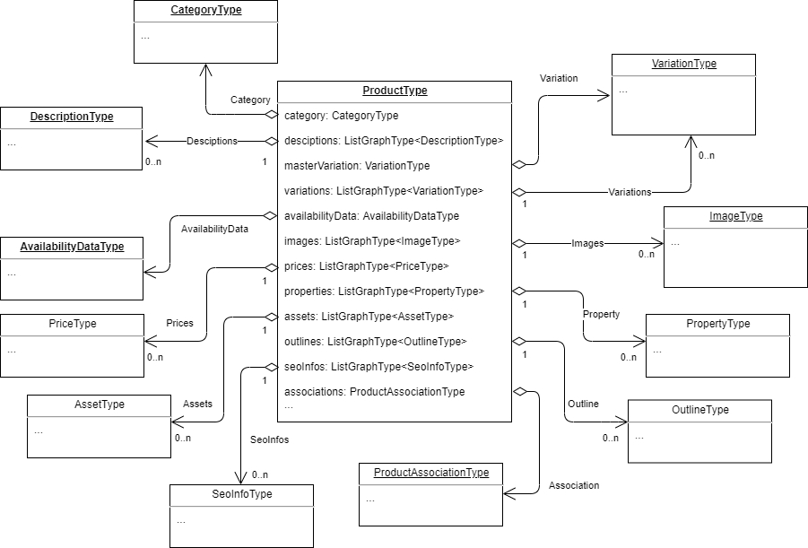
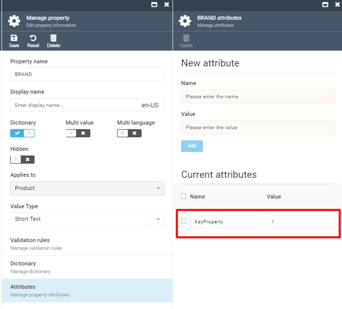
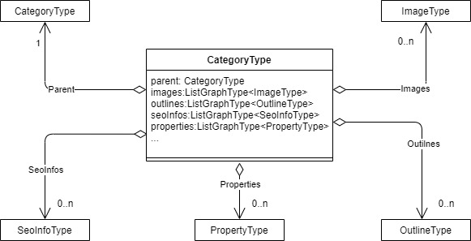

# X-Catalog

X-Catalog provides high performance search queries for catalog data directly from the search index engine.

## Key Features

- Full-text search ([→](#full-text-search))
- Fuzzy search ([→](#fuzzy-search))
- Filters syntax ([→](filter-syntax.md))
- Filter by category subtree ([→](#filter-by-category))
- Filter by price ([→](#filter-by-price))
- Filter by custom properties ([→](#filter-by-custom-properties))
- Filter by products availability ([→](#filter-by-product-availability))
- Facets ([→](#facets))
- Multi-select faceting search ([→](#muti-select-faceting-search))

## How to Use

Please refer to [Experience API Overview](index.md) to for more information on how to use X-Catalog.

## QueryRoot
### Product

This query allows you to get a product by ID and calculate all the fields based on the parameters sent.

#### Definition

```
product(id: !string, storeId: !string, userId: !string, currencyCode: string, cultureName: string)
```

#### Arguments
|#|Name        |Type           |Description                |
|-|------------|---------------|---------------------------|
|1|id          |Non null StringGraphType|Product of the Id          |
|2|storeId     |Non null StringGraphType|Store Id                   |
|3|userId      |Non null StringGraphType|Current user Id            |
|4|currencyCode|StringGraphType|Currency code (e.g. "USD") |
|5|cultureName |StringGraphType|Culture name (e.g. "en-US")|

#### Example

```json
{
    product(
        id: "8b7b07c165924a879392f4f51a6f7ce0"
        storeId: "Electronics"
        userId: "d97ee2c7-e29d-440a-a43a-388eb5586087"
        cultureName: "en-us"
        currencyCode: "USD")
    {
        id
        name
    }
}
```

#### Display Tier Pricing on Product Page

```json
query
{
  product(
        id:"9cbd8f316e254a679ba34a900fccb076" 
        storeId:"Electronics"
        currencyCode:"USD")
  {
    prices
    {
      minQuantity
      tierPrices
      {
        quantity
        price
      {
        amount
      }
      }
    }
  }
}
```

### Products

This connection allows you to search for products.

#### Definition

```
products(productIds: string[], storeId: !string, userId: !string, currencyCode: string, cultureName: string, query: string, filter: string, fuzzy: bool, fuzzyLevel: int, facet: string, sort: string)
```

#### Arguments

|# |Name        |Type                     |Description                |
|--|------------|-------------------------|---------------------------|
| 1|productIds  |List of  StringGraphType |Products Ids               |
| 2|storeId     |Non null StringGraphType |Store Id                   |
| 3|userId      |Non null StringGraphType |Current user Id            |
| 4|currencyCode|StringGraphType          |Currency code (e.g. "USD") |
| 5|cultureName |StringGraphType          |Culture name (e.g. "en-US")|
| 6|query       |StringGraphType          |The query parameter performs the full-text search|
| 7|filter      |StringGraphType          |This parameter applies a filter to the query results|
| 8|fuzzy       |BooleanGraphType         |When the fuzzy query parameter is set to true the search endpoint will also return products that contain slight differences to the search text|
| 9|fuzzyLevel  |IntGraphType             |The fuzziness level is quantified in terms of the Damerau-Levenshtein distance, this distance being the number of operations needed to transform one word into another|
|10|facet       |StringGraphType          |Facets calculate statistical counts to aid in faceted navigation|
|11|sort        |StringGraphType          |The sort expression|

#### Example

```json
{
    products(
        storeId: "Electronics"
        userId: "d97ee2c7-e29d-440a-a43a-388eb5586087"
        cultureName: "en-Us"
        currencyCode: "USD"
  	    first: 10
  	    after: "10")
    {
        items
        {
            id
            code
        }
        pageInfo
        {
            hasNextPage
            startCursor
        }
    }
}
```

### Categories

This connection allows you to search for categories.

#### Definition

```
categories(categoryIds: string[], storeId: !string, userId: !string, currencyCode: string, cultureName: string, query: string, filter: string, fuzzy: bool, fuzzyLevel: int, facet: string, sort: string)
```

#### Arguments

|# |Name        |Type                     |Description                |
|--|------------|-------------------------|---------------------------|
| 1|categoryIds |List of  StringGraphType |Categories Ids          |
| 2|storeId     |Non null StringGraphType |Store Id                   |
| 3|userId      |Non null StringGraphType |Current user Id            |
| 4|currencyCode|StringGraphType          |Currency code (e.g. "USD") |
| 5|cultureName |StringGraphType          |Culture name (e.g. "en-US")|
| 6|query       |StringGraphType          |The query parameter performs the full-text search|
| 7|filter      |StringGraphType          |This parameter applies a filter to the query results|
| 8|fuzzy       |BooleanGraphType         |When the fuzzy query parameter is set to true the search endpoint will also return categories that contain slight differences to the search text|
| 9|fuzzyLevel  |IntGraphType             |The fuzziness level is quantified in terms of the Damerau-Levenshtein distance, this distance being the number of operations needed to transform one word into another|
|10|facet       |StringGraphType          |Facets calculate statistical counts to aid in faceted navigation|
|11|sort        |StringGraphType          |The sort expression|

#### Example

```json
{
    categories(
        storeId: "Electronics"
        userId: "d97ee2c7-e29d-440a-a43a-388eb5586087"
        cultureName: "en-Us"
        currencyCode: "USD"
  	    first: 10
  	    after: "10")
    {
        items
        {
            id
            name
            hasParent
        }
        pageInfo
        {
            hasNextPage
            startCursor
        }
    }
}
```

### Child Categories

This query returns child categories for a specified parent category.

#### Definition

```
childCategories(storeId: !string, userId: string, cultureName: string, currencyCode: string, categoryId: string, maxLevel: int, onlyActive: boolean, productFilter: string)
```

#### Arguments

|#|Name        |Type                    |Description|
|-|------------|------------------------|-----------|
|1|storeId     |Non null StringGraphType|Store ID|
|2|userId      |StringGraphType         |Current user ID|
|3|currencyCode|StringGraphType         |Currency code (e.g. "USD")|
|4|cultureName |StringGraphType         |Culture name (e.g. "en-US")|
|5|categoryId  |StringGraphType         |Parent category ID or null for the root of the catalog|
|6|maxLevel    |IntGraphType            |The number of child category levels to return. 1 - direct children, 2 - direct children and grandchildren, and so on|
|7|onlyActive  |BooleanGraphType        |True - return only active child categories, False - return active and inactive child categories|
|8|productFilter|StringGraphType        |Parameter is used to apply a filter to the query results, allowing you to retrieve only the categories that contain products that meet the specified filters.|


#### Example

```json
query {
  childCategories(
    storeId: "test"
    userId: "067839fd-f223-49ba-b703-55569caa5e72"
    cultureName: "en-US"
    currencyCode: "USD"
    categoryId: "532a6b5a-cf15-461a-836e-71bad60d49a3"
    maxLevel: 2
    onlyActive: true
    productFilter: "category.subtree:fc596540864a41bf8ab78734ee7353a3/532a6b5a-cf15-461a-836e-71bad60d49a3 price:(0 TO) instock_quantity:(0 TO)") {
    childCategories {
      id
      name
      childCategories {
        id
        name
      }
    }
  }
}
```

### Properties

This connection allows you to search for catalog properties metadata.

#### Definition

```
properties(storeId: !string, types: [PropertyType], filter: string, cultureName: string)
```

#### Arguments

|# |Name        |Type                     |Description                |
|--|------------|-------------------------|---------------------------|
| 1|storeId      |Non null StringGraphType |Store Id            |
| 2|types      |ListGraphType of PropertyTypeEnum's |The owner types (Catalog, Category, Product, Variation or combinations)            |
| 3|filter      |StringGraphType |This parameter applies a filter to the query results           |
| 4|cultureName      |StringGraphType |Culture name (e.g. "en-US")            |

#### Example 1

Enlist properties metadata with dictionary items, specified culture, specific name and types:

```json
{
  properties (storeId:"Electronics", cultureName:"de-DE", filter:"keyword:Brand", types:[PRODUCT, VARIATION])
  {
    items
    {
      name
      type
      id
      multivalue
      propertyDictItems
      {
        totalCount
        items
        {
          value
        }
      }
    }
  }
}
```

#### Example 2

Get properties for a specific category:

```json
{
  properties (storeId:"Electronics", filter:"categoryId:53e239451c844442a3b2fe9aa82d95c8")
  {
    items
    {
      name
      type
      id
      multivalue
      propertyDictItems
      {
        totalCount
        items
        {
          value
        }
      }
    }
  }
}
```

### Property

This connection allows you to get metadata for a specific catalog property.

#### Definition

```
property(id: !string, cultureName: string)
```

#### Arguments
|#|Name        |Type                     |Description                |
|--|------------|-------------------------|---------------------------|
| 1|id      |Non null StringGraphType |Property id            |
| 2|cultureName      |StringGraphType |Culture name (e.g. "en-US")            |

#### Example

Get a single property with dictionary items for a specific culture:

```json
{
  property (id:"43d14478-d142-4a65-956f-0a308d0c4ee8", cultureName:"de-DE")
  {
    propertyDictItems
    {
      items
      {
        value
      }
    }
  }
}
```

### Fulfillment Center

This query allows you to get a fulfillment center by ID.

#### Definition

```
fulfillmentCenter(id: !string)
```

#### Arguments
|#|Name        |Type         |Description|
|--|-----------|-------------|-----------|
| 1|id |Non null StringGraphType |Fulfillment center id |


#### Example
Get a single fulfillment center with the top 3 nearest fulfillment centers 

```js
query {
  fulfillmentCenter(
    id: "vendor-fulfillment"
  ) {
    id
    name
    description
    shortDescription
    outerId
    geoLocation
    address {
      city
    }
    nearest (take: 3) {
      name
      id
    }
  }
}
```

### Fulfillment Centers

This connection allows you to search for fulfillment centers.

#### Definition

```
fulfillmentCenters(after: String, first: Int, storeId: String, query: String, sort: String, fulfillmentCenterIds: [String])
```

#### Arguments
|#|Name        |Type         |Description|
|--|-----------|-------------|-----------|
| 1|first |IntGraphType |Pagination size. Default is 20|
| 2|after |StringGraphType |Pagination cursor|
| 3|sort |StringGraphType |The sort expression|
| 4|storeId |StringGraphType |Search fulfillment centers by store ID|
| 5|query |StringGraphType |Search by fulfillment center name|
| 6|fulfillmentCenterIds |List of StringGraphType |Get fulfillment centers by provided IDs. Note: this argument is exclusive, if set it will override all other arguments|


#### Example 1

Get 2 fulfillment centers by known IDs:

```js
query {
  fulfillmentCenters(
    fulfillmentCenterIds: ["vendor-fulfillment", "los-angeles-fulfillment"]
  ) {
    totalCount
    items {
      id
      name
      shortDescription
      address {
        city
        countryCode
      }
    }
  }
}
```

#### Example 2

Get all fulfillment centers attached to B2B Store: 

```js
query {
  fulfillmentCenters(
    storeId: "B2B-store"
  )
   {
    totalCount
    items {
      id
      name
      outerId
      geoLocation
    }
  }
}
```

## Queriable Objects

### ProductType


#### Schema fields

|# |Name             |Type                                 |Description|
|--|-----------------|-------------------------------------|-----------|
| 1|id               |StringGraphType                      |The unique ID of the product|
| 2|code             |StringGraphType                      |The product SKU|
| 3|catalogId        |StringGraphType                      |CatalogId of the product|
| 4|category         |[CategoryType](#categorytype) |Field to resolve category of the requested product|
| 5|name             |StringGraphType                      |Name of the product|
| 6|descriptions     |List of DesciptionType               |Reviews of product|
| 7|productType      |StringGraphType                      |The type of product|
| 8|slug             |StringGraphType                      |Url of the product|
| 9|metaDescription  |StringGraphType                      |Meta description of the product|
|10|metaKeywords     |StringGraphType                      |Meta keywords of the product|
|11|metaTitle        |StringGraphType                      |Meta title of the product|
|12|imgSrc           |StringGraphType                      |Main image of the product|
|13|outerId          |StringGraphType                      |Category outer Id|
|14|brandName        |StringGraphType                      |Brand name of the product|
|15|masterVariation  |VariationType                        |Main variation of the product|
|16|variations       |List of VariationType                |Product variations|
|17|availabilityData |AvailabilityDataType                 |Product availability information|
|18|images           |List of ImageType                    |Product images|
|19|prices           |List of PriceType                    |Product prices|
|20|properties       |List of PropertyType                 |Product properties|
|21|assets           |List of AssetType                    |Product assets|
|22|outlines         |List of OutlineType                  |Category outlines|
|23|seoInfos         |List of SeoInfoType                  |SEO information of the product|
|24|associations     |ProductAssociationType               |Product associations|
|25|breadcrumbs      |BreadcrumbType                       |Product navigation information|
|26|videos           |VideoType                            |Product videos|
|27|keyProperties    |List of PropertyType                 |Configurable list of properties

#### Product Key Properties

The `ProductType` query has a special configurable field, `keyProperties`. To make a catalog property appear in the `keyProperties` list, you need to configure it in the Catalog module by adding the `KeyProperty` attribute to `Property Attributes`. `KeyProperties` are auto sorted by the attribute value in the ascending order.



The `keyProperties` field can be limited by the `take` argument.

#### Example
The following query enables showing only first three key properties:

```json
query {
  products(
    storeId: "B2B-store"
    cultureName: "en-US"
  ) {
    items 
    {
      keyProperties (take:3) {
        name
        value
      }
    }
  }
}
```

### CategoryType



#### Schema fields

|#|Name      |Type                   |Description|
|-|----------|-----------------------|-----------|
|1|id        |StringGraphType        |Id of category|
|2|code      |StringGraphType        |SKU of category|
|3|name      |StringGraphType        |Name of category|
|4|slug      |StringGraphType        |Url of category|
|5|parent    |CategoryType           |Field to resolve parent category|
|6|hasParent |BooleanGraphType       |Indicates if category has parent|
|7|images    |List of ImageType      |Category images|
|8|outlines  |List of OutlineType    |Category outlines|
|9|seoInfos  |List of SeoInfoType    |SEO information of the category|
|9|properties  |List of PropertyType    |Properties of the category|


### FulfillmentCenterType

#### Schema fields
|#|Name|Type|Description|
|-|----------|----------|-----------|
|1|id|StringGraphType|Fulfillment center ID|
|2|name|StringGraphType|Fulfillment center name|
|4|description|StringGraphType|Full description of the fulfillment center|
|5|shortDescription|StringGraphType|Short description of the fulfillment center|
|6|geoLocation|StringGraphType|Fulfillment center geo location. Latitude and longitude are separated with a comma without spaces, e.g. "41.40338,12.17403"|
|9|outerId|StringGraphType|Fulfillment center outer ID|
|9|address|FulfillmentCenterAddressType|Fulfillment center address|
|9|nearest|List of FulfillmentCenterType|Contains the top 10 nearest fulfillment centers ordered by distance between geo-coordinates. Accepts the `take` (int) argument to limit the selection|

### AvailabilityDataType
Returns product availability information.

#### Schema fields
|#|Name|Type|Description|
|-|----------|----------|-----------|
|1|availableQuantity|LongGraphType|Quantity in all fulfillment centers|
|2|isBuyable|BooleanGraphType|True when product is possible to buy on global.|
|4|isAvailable|BooleanGraphType|True product is available for order, pre-order, back-order  in any fulfillment centers|
|5|isInStock|BooleanGraphType|True product is InStock in any fulfillment centers|
|6|isActive|BooleanGraphType|True when product is active.|
|7|isTrackInventory|BooleanGraphType|True when Virto Commerce controls inventory and decreases stock automatically.|
|8|inventories|List of InventoryInfo|Contains availability of the product in different Fulfillment centers|


### InventoryInfo
Returns product inventory information from a fulfillment

#### Schema fields
|#|Name|Type|Description|
|-|----------|----------|-----------|
|1|inStockQuantity|LongGraphType|Quantity in a fulfillment center|
|2|reservedQuantity|LongGraphType|Reserved Quantity in a fulfillment center|
|4|fulfillmentCenterId|StringGraphType|Id of fulfillment center|
|5|fulfillmentCenterName|StringGraphType|Name of fulfillment center|
|6|allowPreorder|BooleanGraphType|True when fulfillment center allows preorder|
|7|allowBackorder|BooleanGraphType|True when fulfillment center allows backorder|
|8|preorderAvailabilityDate|DateTimeGraphType|Date and Time of Availability for preorder|
|9|backorderAvailabilityDate|DateTimeGraphType|Date and Time of Availability for backorder|


#### Example 1
The following query returns inventory information with products:

```json
query {
  products(
    storeId: "B2B-store"
    cultureName: "en-US"
  ) {
    items 
    {
        name
        availabilityData
        {
            isActive
            inventories
            {
                fulfillmentCenterId
                fulfillmentCenterName
                inStockQuantity
            }

        }
      
    }
  }
}
```

#### Example 2
The following query returns inventory information with the product:

```json
query {
  product(
    id: "6a44c625667e4dca85768b5b18428e42"
    storeId: "B2B-store"
    cultureName: "en-US"
  ) {
      name
      availabilityData
      {
          isActive
          inventories
          {
              fulfillmentCenterId
              fulfillmentCenterName
              inStockQuantity
          }
      }
  }
}
```

## Syntax

### Full-Text Search

The *query* parameter performs the full text search against the product index document. It expects a full text search phrase.

#### Searchable Fields

The search performs full text search over product data in the index. Product search returns all product variations a product has.
All searchable text data of a product are stored in the single `__content` field in the resulting index document; the full text search is performed only for this field.

An example of product document in the index may look like this:

```json
"__content": [
    "JGC-85796278",
    "ASUS ZenFone 2 ZE551ML Gold",
    "asus",
    "android",
    "2.3 ghz intel gtx quad-core",
    "micro-sim",
    "1080"
  ],
```

The following product properties are stored in the `__content` field and are searched by default.

- `product.name`
- `product.code`
- `product.seoinfos.seoinfo.slug`
- `product.properties.value`
- `product.variations.code`
- `product.variations.properties.value`

Example requests:

```json
# Search all products by keyword `sony` and return the name and primary image URL for first 20 found products and total count
{
  products(query: "sony" storeId: "Electronics" first:20) {
      totalCount
      items
      {
        name
        imgSrc
      }
  }
}
```

### Fuzzy Search

When the `fuzzy` query parameter is set to true, the search will also return [products]() that contain slight differences to the search text.
For example, when someone searches for ‘unversty’, the fuzzy search would also return products labelled with ‘university’.
The fuzzy level can be optionally set with the parameter `fuzzyLevel`; otherwise, the search will use auto fuzzy level based on the length of the searched text, with the minimum value at 3, and maximum, at 6.

Example requests:

```json
# Will return products that contain "university", "unversty", "universe", etc.
{
  products(query: "unversty" storeId: "Electronics" first:20) {
      totalCount
      items
      {
        name
        imgSrc
      }
  }
}
```

### Filter by Category

You can also filter products that belong to the exactly specified category path.

`filter: "category.path:{catalog id/category path}"`

`filter: "category.path:catalogId/cat1d1/cat2id"`

> The search will be performed on `__path` index field of the product document

Filter by category subtrees, keep only the products that belong to the specified Category or any of its descendant categories.

`filter: "category.subtree:{catalog id/category path}"`

`filter: "category.subtree:catalogId/cat1d1/cat2id"`

> The search will be performed on `__outline` index field of product document


### Filter by Price

This flter will include only the products, the price of which matches the specified value or [range]()

`filter: "price.{currency}.{pricelist?}:{range expression}"`

`filter: "price.usd:(TO 100]"`

`filter: "price.usd.pricelist_1:(20 TO 100]"`

Keep only products that  with at least one price set

`filter: "is:priced`

> The search will be performed based on the `price_{currency}` and `price_{currency}_{pricelist}` index fields of the product document.
> Please note: Only the indexed prices may be used for filtration. Scoped prices based on user groups or dynamic expressions temporary do not support filtration.

### Filter by SKU

Use this filter to keep only the product that matches the specified SKU:

`filter: "sku:DLL-65789352`

### Filter Products or Variations

This includes only either the products or variations in the result. If not set, it will return both types.

`filter: "is:product status:visible"`

`filter: "is:variation status:hidden"`

#### Example

Display products and variations in the list from a specific category:

```json
query {
  products(
    storeId: "B2B-store"
    cultureName: "en-US"
    first:20
    after: "0"
   	filter:"status:hidden,visible category.path:7829d35f417e4dd98851f51322f32c23/4fbaca886f014767a52f3f38b9df648f"
  ) {
    items 
    {
      name
    }
    totalCount
  }}
```

### Filter by custom properties

Keep only the products or variation with the custom attribute matching the specified value or range.

`filter: "properties.{property name}: {value}`

`filter: "properties.color:red`

To use property name contains spaces need to use the following syntax with escaped double quotes
`filter= "\"processor core (ghz)\":\"1.8 GHz Intel GTX Quad-Core\""`

For numeric and date time properties you might use range filter

`filter: "length:(10 TO 20)"`

`filter: "publishDate:(TO \"2020-01-28\")"`

> All product custom properties are stored in the index as fields with the same names as properties have.  `{property.name}:{property.value}`

### Filter by product availability

Keep only the products or variations with the availability matching the specified value or range.

`filter: "available_in:{warehouse}"`

`filter: "available_in:my-warehouse"`


### Muti-select faceting search

The policy let select multiple values of the same facet (e.g using checkbox).

You can read more for how the muti-select faceting search work on this great article [How to implement multi-select faceting for nested documents in Solr](https://blog.griddynamics.com/multi-select-faceting-for-nested-documents-in-solr/) and [Elastic search post filter](https://www.elastic.co/guide/en/elasticsearch/reference/7.6/search-request-body.html#request-body-search-post-filter)

The muti-select faceting search policy is enabled by default and you do not need any extra parameters or setting to activate it.

### Sorting

By default, search results are sorted descending by their relevancy with respect to the provided text (that is their “score”). An alternative sorting can be specified  via the sort query parameter which has the structure `{field}:{asc|desc}` you can combine multiple sort expression  by semicolon  `;`

`sort: "priority:desc;price_usd;score"`

### Facets

Faceted search (sometimes also called faceted navigation) allows users to navigate through a web site by applying filters for categories, attributes, price ranges and so on. The main idea behind faceted search is to present the attributes of the documents of the previous search result as filters, which can be used by the user to narrow down search results along with calculate statistical counts to aid.

Facet calculation is requested by providing facet expression via the facet query parameter. Consider for example the following two facets:

`facet: "color price:[TO 100),[100 TO 200])"`

The resulting json would be like seen here:

```json
"data": {
    "products": {
      "totalCount": 182,
      "items": [...],
      "range_facets": [
        {
          "name": "price_*-100_100-200",
          "ranges": [
            {
              "from": 0,
              "to": 100,
              "count": 5959,
              "includeTo": false,
              "includeFrom": true
            },
            {
              "from": 100,
              "to": 200,
              "count": 2143,
              "includeTo": true,
              "includeFrom": true
            }
          ]
        }
      ],
      "term_facets": [
        {
          "name": "color",
          "terms": [
            {
              "term": "EXPRESSO",
              "count": 2343
            },
            {
              "term": "Sierra Brown",
              "count": 362
            },
            ...
        }]
    }
}
```

### TermFacet expression

To retrieve facet counts for all occurring values of a product document field the following notations can be applied:

`facet: "category.path"`

Counts the products of all categories.

`facet: "{propertyName}"`
`facet: "properties.{propertyName}"`

Counts the product documents for all occurring values of custom  properties.

### TermFacet result

The term type facets provide the counts for each of the different values the query parameter happens to have.

`name` - represents the key of requested facet taken from facet expression.
`terms.term` - one of the values for the field specified in facet expression for which at least one product could be found
`terms.count` - amount of products  for which the term applies
`terms.isSelected` - flag indicates that requested facet term is used in `filter` expression, in order to simplify displaying the already selected facet terms on the frontend.

### RangeFacet expression

To aggregate facet counts across ranges of values, the range qualifier can be applied analogous to the filter parameters. The `range` notation is applicable to the date, time, datetime, number and money type fields.

`facet: "price.{currency}:[TO 100),[100 TO 200])"`
Counts the products whose price falls in one of the specified ranges

`facet: "properties.{propertyName}[1 TO 100)"`
Counts the products whose values of the custom property fall in one of the specified ranges

### RangeFacet result

The range facet type counts the products for which the query value is a range specified in the range expression. Range facets are typically used to determine the minimum and maximum value for example product prices to filter products by price with a range slider.

`name`: represents the key of requested facet taken from facet expression and build from range parameters concatenated by `_`. e.g `price_*-100_100-200`
`ranges.from`: the range’s lower endpoint in number format
`ranges.to`: the range’s upper endpoint in string format
`ranges.count`: amount of products fall into the specified range
`ranges.includeTo`: flag indicates that lower bound is included
`ranges.includeFrom`: flag indicates that upper bound is included
`ranges.isSelected`: flag indicates that requested facet term is used in `filter` expression, in order to simplify displaying the already selected facet terms on the frontend.

### Querying product breadcrumbs

When querying breadcrumbs of the product make sure your store's `SEO Links` setting is **not** set to `None`, otherwise breadcrumbs for the store would not be created. To check the setting go to Store - select your store - Settings - SEO - SEO Links.
