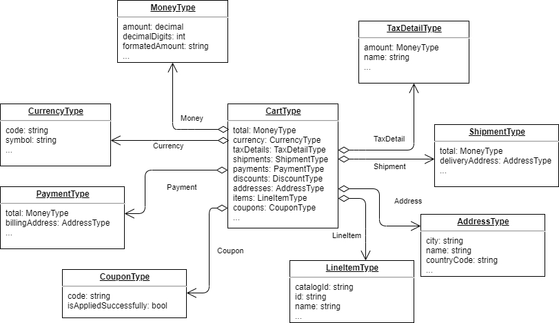

# X-Purchase Cart

X-Purchase-Cart provides high performance API for shopping cart.

## Key features

- Working with shopping cart;
- Auto evaluating taxes and prices;
- Multi-Laguage;
- Multi-Currency;
- Lazy resolving;

## QueryRoot

#### List of queries:

|#|Endpoint|Arguments|Return|
|------|---------|---------|---------|
|1|[cart](#cart)|`storeId` `cartName` `userId` `cultureName` `currencyCode` `cartType`|Shopping cart|
|2|[carts](#carts)|`storeId` `cartName` `userId` `cultureName` `currencyCode` `cartType` `sort` `skip` `take`|Paginated shopping cart list|

### Cart

```
{
    cart (storeId: "Electronics"
        cartName: "default"
        userId: "d97ee2c7-e29d-440a-a43a-388eb5586087"
        cultureName: "en-Us"
        currencyCode: "USD"
        cartType: "cart")
    {
        id
        name
        hasPhysicalProducts
        status
        storeId
        isAnonymous
        comment
        taxPercentRate
        taxType
        addresses { countryName regionName city addressType }
        dynamicProperties { name value valueType }
        shipments { shipmentMethodCode shipmentMethodOption }
        availableShippingMethods { code optionName optionDescription }
        discounts { amount description }
        currency { code symbol }
        payments { paymentGatewayCode }
        availablePaymentMethods { code paymentMethodType }
        items { id sku }
        coupons { code isAppliedSuccessfully }
        itemsCount
        itemsQuantity
        type
    }
}
```
> [!TIP]
> See also CartType schema for better understanding of possible fields in request.

### Carts connection

With this connection you can get all user's carts/whishlists.
```
{
    carts (storeId: "Electronics"
        userId: "d97ee2c7-e29d-440a-a43a-388eb5586087"
        cultureName: "en-Us"
        currencyCode: "USD"
        cartType: "cart"
        take: 5
        skip: 0)
    {
        items
        {
            id
            name
            hasPhysicalProducts
            status
            storeId
            isAnonymous
        }
        pageInfo
        {
            startCursor
            endCursor
            hasNextPage
            hasPreviousPage
        }
    }
}
```

## Queriable objects

### CartType



### CartType Addresses field

Field `Cart.Addresses` in `CartType` is a functional enabler. Currently it does not participate in any internal business logic and it is separated from `Cart.Billing.Addresses` and `Cart.Shipping.Addresses`. Feel free to add your own business logic to it.
Address type structure can be found [here](https://github.com/VirtoCommerce/vc-module-experience-api/blob/dev/src/VirtoCommerce.ExperienceApiModule.Core/Schemas/AddressType.cs).

## Mutations

Every mutation contains base arguments for working with cart context:
- `storeId` - Id of current store
- `cartName` - Cart name
- `userId` - Id of current user
- `currencyCode` - Currency code (e.g. "USD")
- `cultureName` - Culture name of current language (e.g. "en-Us")
- `cartType` - Type of cart ("cart" or "whishlist")

#### Mutation list:
|# |Endpoint|Arguments|Description|
|--|-----------------------|---------------------|---------|
|1 |[addItem](#additem)|`!productId` `!quantity` `price` `comment`|Add item to cart.|
|2 |[clearCart](#clearcart)|-|Remove items from cart.|
|3 |[changeComment](#changecomment)|`comment`|Update cart comment.|
|4 |[changeCartItemPrice](#changecartitemprice)|`!productId` `!price`|Change cart item price.|
|5 |[changeCartItemQuantity](#changecartitemquantity)|`!lineItemId` `!quantity`|Change cart item quantity.|
|6 |[changeCartItemComment](#changecartitemcomment)|`!lineItemId` `comment`|Change cart item comment.|
|7 |[removeCartItem](#removecartitem)|`!lineItemId`|Remove cart item from cart.|
|8 |[addCoupon](#addcoupon)|`!couponCode`|Add coupon to cart.|
|9 |[removeCoupon](#removecoupon)|`couponCode`|Remove coupon from cart. If coupon not passed clear all coupons from cart.|
|10|[removeShipment](#removeshipment)|`shipmentId`|Remove shipment from cart.|
|11|[addOrUpdateCartShipment](#addorupdatecartshipment)|`!shipment`([type](https://github.com/VirtoCommerce/vc-module-experience-api/blob/dev/src/XPurchase/VirtoCommerce.XPurchase/Schemas/InputShipmentType.cs))|Add or update shipment for cart.|
|12|[addOrUpdateCartPayment](#addorupdatecartpayment)|`!payment`([type](https://github.com/VirtoCommerce/vc-module-experience-api/blob/dev/src/XPurchase/VirtoCommerce.XPurchase/Schemas/InputPaymentType.cs))|Add or update payment for cart.|
|13|[validateCoupon](#validatecoupon)|`!coupon`|Validate coupon, return result.|
|14|[mergeCart](#mergecart)|`!secondCartId`|Merge two carts into one.|
|15|[removeCart](#removecart)|`!cartId`|Remove cart.|
|16|[clearShipments](#clearshipments)|-|Clear cart shipments.|
|17|[clearPayments](#clearpayments)|-|Clear cart payments.|
|18|[updateCartDynamicProperties](#updatecartdynamicproperties)|`!dynamicProperties`|Updates dynamic properties in cart.|
|19|[updateCartItemDynamicProperties](#updatecartitemdynamicproperties)|`!lineItemId` `!dynamicProperties`|Updates dynamic properties in cart items.|
|20|[updateCartShipmentDynamicProperties](#updatecartshipmentdynamicproperties)|`!shipmentId` `!dynamicProperties`|Updates dynamic properties in cart shipment.|
|21|[updateCartPaymentDynamicProperties](#updatecartpaymentdynamicproperties)|`!paymentId` `!dynamicProperties`|Updates dynamic properties in cart payment.|
|22|[addCartAddress](#addcartaddress)|`!address`([type](https://github.com/VirtoCommerce/vc-module-experience-api/blob/dev/src/XPurchase/VirtoCommerce.XPurchase/Schemas/InputAddOrUpdateCartAddressType.cs))|Add address for cart or update it by type
|23|[addWishlistBulkItem](#addwishlistbulkitem)|`!listIds` `!productId`|Add product to few wish lists.|
|24|[refreshCart](#refreshCart)||Refresh the contents of a shopping cart without making any modifications to the items in it.|

> [!NOTE]
> In arguments column we only show additional arguments. if they are marked with an exclamation mark, they are required.

### AddItem

This mutation validates item and add it to cart, recalculate promotion rewards and taxes then save cart.

#### Query

```
mutation ($command:InputAddItemType!)
{
    addItem(command: $command)
    {
        name
        items
        {
            id
            sku
        }
        itemsCount
        itemsQuantity
    }
}
```

#### Variables

```json
{
    "command": {
        "storeId": "Electronics",
        "cartName": "default",
        "userId": "b57d06db-1638-4d37-9734-fd01a9bc59aa",
        "cultureName": "en-US",
        "currencyCode": "USD",
        "cartType": "cart",
        "productId": "9cbd8f316e254a679ba34a900fccb076",
        "quantity": 1,
        "dynamicProperties": [
            {
                "name": "ItemProperty",
                "value": "test value"
            }
        ]
    }
}
```

### RefreshCart

This mutation loads the cart from its persistent storage, then immediately saves it back without any modifications. This effectively triggers any relevant price updates and clears any warnings that may have been present.

#### Query

```
mutation ($command:RefreshCartType!)
{
    refreshCart(command: $command)
    {
        itemsCount
        itemsQuantity
    }
}
```

#### Variables

```json
{
  "command": {
    "storeId": "B2B-store",
    "userId": "39e3f3c5-7dd3-40ce-b48b-99549c1cd702",
    "cartId": "d77a2584-6b45-4b34-818a-9302ec15da5d"
  }
}
```

### ClearCart

This mutation removes all items from cart, reset promotion rewards based on amount of items and save cart.

#### Query

```json
mutation ($command:InputClearCartType!)
{
    clearCart(command: $command)
    {
        name
        items
        {
            id
            sku
        }
        itemsCount
        itemsQuantity
    }
}
```

#### Variables

```json
{
    "command": {
        "storeId": "Electronics",
        "cartName": "default",
        "userId": "b57d06db-1638-4d37-9734-fd01a9bc59aa",
        "cultureName": "en-US",
        "currencyCode": "USD",
        "cartType": "cart"
    }
}
```

### ChangeComment

This mutation changes cart comment.

#### Query

```json
mutation ($command:InputChangeCommentType!)
{
    сhangeComment(command: $command)
    {
        name
        comment
    }
}
```

#### Variables

```json
{
    "command": {
        "storeId": "Electronics",
        "cartName": "default",
        "userId": "b57d06db-1638-4d37-9734-fd01a9bc59aa",
        "cultureName": "en-US",
        "currencyCode": "USD",
        "cartType": "cart",
        "comment": "Hi, Virto! :)"
    }
}
```

### ChangeCartItemPrice

This mutation changes cart item price.

#### Query

```json
mutation ($command:InputChangeCartItemPriceType!)
{
    changeCartItemPrice(command: $command)
    {
        id
        items
        {
            sku
            productId
            listPrice
            listPriceWithTax
            salePrice
            salePriceWithTax
        }
    }
}
```

#### Variables

```json
{
    "command": {
        "storeId": "Electronics",
        "cartName": "default",
        "userId": "b57d06db-1638-4d37-9734-fd01a9bc59aa",
        "cultureName": "en-US",
        "currencyCode": "USD",
        "cartType": "cart",
        "productId": "9cbd8f316e254a679ba34a900fccb076",
        "price": 777
    }
}
```

### ChangeCartItemQuantity

This mutation changes cart item quantity.

#### Query

```json
mutation ($command:InputChangeCartItemQuantityType!)
{
    changeCartItemQuantity(command: $command)
    {
        id
        items
        {
            sku
            productId
            quantity
        }
        itemsCount
        itemsQuantity
    }
}
```

#### Variables

```json
{
    "command": {
        "storeId": "Electronics",
        "cartName": "default",
        "userId": "b57d06db-1638-4d37-9734-fd01a9bc59aa",
        "cultureName": "en-US",
        "currencyCode": "USD",
        "cartType": "cart",
        "lineItemId": "9cbd8f316e254a679ba34a900fccb076",
        "quantity": 7
    }
}
```

### ChangeCartItemComment

This mutation changes cart item comment.

#### Query

```json
mutation ($command:InputChangeCartItemCommentType!)
{
    changeCartItemComment(command: $command)
    {
        id
        items
        {
            sku
            productId
            comment
        }
    }
}
```
#### Variables

```json
{
    "command": {
        "storeId": "Electronics",
        "cartName": "default",
        "userId": "b57d06db-1638-4d37-9734-fd01a9bc59aa",
        "cultureName": "en-US",
        "currencyCode": "USD",
        "cartType": "cart",
        "lineItemId": "9cbd8f316e254a679ba34a900fccb076",
        "comment": "nice product"
    }
}
```

### RemoveCartItem

This mutation removes item from cart.

#### Query

```json
mutation ($command:InputRemoveItemType!)
{
    removeCartItem(command: $command)
    {
        id
        items
        {
            sku
            productId
        }
        itemsCount
        itemsQuantity
    }
}
```

#### Variables

```json
{
    "command": {
        "storeId": "Electronics",
        "cartName": "default",
        "userId": "b57d06db-1638-4d37-9734-fd01a9bc59aa",
        "cultureName": "en-US",
        "currencyCode": "USD",
        "cartType": "cart",
        "lineItemId": "9cbd8f316e254a679ba34a900fccb076",
    }
}
```

### AddCoupon

This mutation checks and adds coupon to cart.

#### Query

```json
mutation ($command:InputAddCouponType!)
{
    addCoupon(command: $command)
    {
        name
        coupons
        {
        	code
            isAppliedSuccessfully
        }
    }
}
```

#### Variables

```json
{
    "command": {
        "storeId": "Electronics",
        "cartName": "default",
        "userId": "b57d06db-1638-4d37-9734-fd01a9bc59aa",
        "cultureName": "en-US",
        "currencyCode": "USD",
        "cartType": "cart",
        "couponCode": "freeItemsCouponCode",
    }
}
```

### RemoveCoupon

This mutation removes coupon from cart.

#### Query

```json
mutation ($command:InputRemoveCouponType!)
{
    removeCoupon(command: $command)
    {
        name
        coupons
        {
        	code
            isAppliedSuccessfully
        }
    }
}
```

#### Variables

```json
{
    "command": {
        "storeId": "Electronics",
        "cartName": "default",
        "userId": "b57d06db-1638-4d37-9734-fd01a9bc59aa",
        "cultureName": "en-US",
        "currencyCode": "USD",
        "cartType": "cart",
        "couponCode": "freeItemsCouponCode",
    }
}
```

### RemoveShipment

This mutation removes shipment from cart.

#### Query

```json
mutation ($command:InputRemoveShipmentType!)
{
    removeShipment(command: $command)
    {
        name
        availableShippingMethods
        {
          code
          optionName
          optionDescription
        }
    }
}
```

#### Variables

```json
{
    "command": {
        "storeId": "Electronics",
        "cartName": "default",
        "userId": "b57d06db-1638-4d37-9734-fd01a9bc59aa",
        "cultureName": "en-US",
        "currencyCode": "USD",
        "cartType": "cart",
        "shipmentId": "7777-7777-7777-7777",
    }
}
```

### AddOrUpdateCartShipment

This mutation adds or updates shipment of cart. This mutation supports partial update, all fields in `command.shipment` and `command.shipment.deliveryAddress` are optional.

#### Query

```json
mutation ($command:InputAddOrUpdateCartShipmentType!)
{
    addOrUpdateCartShipment(command: $command)
    {
        name
        availableShippingMethods
        {
          code
          optionName
          optionDescription
        }
    }
}
```

#### Variables

```json
{
    "command": {
        "storeId": "Electronics",
        "cartName": "default",
        "userId": "b57d06db-1638-4d37-9734-fd01a9bc59aa",
        "cultureName": "en-US",
        "currencyCode": "USD",
        "cartType": "cart",
        "shipment": {
            "fulfillmentCenterId": "7777-7777-7777-7777",
            "height": 7,
            "shipmentMethodCode": "code",
            "currency": "USD",
            "price": 98,
            "dynamicProperties": [
                {
                    "name": "ShipmentProperty",
                    "value": "test value"
                }
            ]
        },
    }
}
```

> [!TIP]
> To see all possible parametrs for shipment object [look here...](https://github.com/VirtoCommerce/vc-module-experience-api/blob/dev/src/XPurchase/VirtoCommerce.XPurchase/Schemas/InputShipmentType.cs)

### AddOrUpdateCartPayment

This mutation adds or updates payment of cart. This mutation supports partial update, all fields in `command.payment` and `command.payment.billingAddress` are optional.

#### Query

```json
mutation ($command:InputAddOrUpdateCartPaymentType!)
{
    addOrUpdateCartPayment(command: $command)
    {
        name
        availablePaymentMethods
        {
          code
          name
          paymentMethodType
        }
    }
}
```
#### Variables

```json
{
    "command": {
        "storeId": "Electronics",
        "cartName": "default",
        "userId": "b57d06db-1638-4d37-9734-fd01a9bc59aa",
        "cultureName": "en-US",
        "currencyCode": "USD",
        "cartType": "cart",
        "payment": {
            "outerId": "7777-7777-7777-7777",
            "paymentGatewayCode": "code",
            "currency": "USD",
            "price": 98,
            "amount": 55,
            "dynamicProperties": [
                {
                    "name": "PaymentProperty",
                    "value": "test value"
                }
            ]
        },
    }
}
```

> [!TIP]
> To see all possible parametrs for payment object [look here...](https://github.com/VirtoCommerce/vc-module-experience-api/blob/dev/src/XPurchase/VirtoCommerce.XPurchase/Schemas/InputPaymentType.cs)

### ValidateCoupon

This mutation validates coupon.

#### Query

```json
mutation ($command:InputValidateCouponType!)
{
    validateCoupon(command: $command)
}
```

#### Variables

```json
{
    "command": {
        "storeId": "Electronics",
        "cartName": "default",
        "userId": "b57d06db-1638-4d37-9734-fd01a9bc59aa",
        "cultureName": "en-US",
        "currencyCode": "USD",
        "cartType": "cart",
        "coupon": "freeItemsCouponCode"
    }
}
```

### MergeCart

This mutation merges two carts. You can use it to merge anonymous cart with user cart after authorization.

#### Query

```json
mutation ($command:InputMergeCartType!)
{
    mergeCart(command: $command)
    {
        id
        isAnonymous
    }
}
```

#### Variables

```json
{
    "command": {
        "storeId": "Electronics",
        "cartName": "default",
        "userId": "b57d06db-1638-4d37-9734-fd01a9bc59aa",
        "cultureName": "en-US",
        "currencyCode": "USD",
        "cartType": "cart",
        "secondCartId": "7777-7777-7777-7777",
    }
}
```

### RemoveCart
This mutation removes cart.

#### Query

```json
mutation ($command:InputRemoveCartType!)
{
    removeCart(command: $command)
}
```

#### Variables

```
{
    "command": {
        "cartId": "7777-7777-7777-7777"
    }
}
```

### ClearShipments

This mutation removes all shipments from cart.

#### Query

```json
mutation ($command:InputClearShipmentsType!)
{
    clearShipments(command: $command)
    {
        name
        availableShippingMethods
        {
          code
          optionName
          optionDescription
        }
    }
}
```

#### Variables

```json
{
    "command": {
        "storeId": "Electronics",
        "cartName": "default",
        "userId": "b57d06db-1638-4d37-9734-fd01a9bc59aa",
        "cultureName": "en-US",
        "currencyCode": "USD",
        "cartType": "cart"
    }
}
```

### ClearPayments

This mutation removes all payments from cart.

#### Query

```json
mutation ($command:InputClearPaymentsType!)
{
    clearPayments(command: $command)
    {
        name
        availablePaymentMethods
        {
          code
          name
          paymentMethodType
        }
    }
}
```

#### Variables

```json
{
    "command": {
        "storeId": "Electronics",
        "cartName": "default",
        "userId": "b57d06db-1638-4d37-9734-fd01a9bc59aa",
        "cultureName": "en-US",
        "currencyCode": "USD",
        "cartType": "cart"
    }
}
```

### UpdateCartDynamicProperties

This mutation updates dynamic properties in cart

#### Query

```json
mutation ($command: InputUpdateCartDynamicPropertiesType!)
{
    updateCartDynamicProperties(command: $command)
    {
        dynamicProperties
        {
            name
            value
            valueType
            dictionaryItem
            {
                label
                name
                id
            }
        }
    }
}
```

#### Variables

```json
{
    "command": {
        "storeId": "Electronics",
        "cartName": "default",
        "userId": "b57d06db-1638-4d37-9734-fd01a9bc59aa",
        "cultureName": "en-US",
        "currencyCode": "USD",
        "cartType": "cart",
        "dynamicProperties": [
            {
                "name": "Example string property",
                "value": "12345678"
            },
            {
                "name": "Example multilanguage property",
                "locale":"de-DE",
                "value": "hallo welt"
            },
            {
                "name": "Example dictionary property",
                "value": "578fadeb1d2a40b3b08b1daf8db09463"
            }
  	    ]
      }
    }
}
```

### UpdateCartItemDynamicProperties

This mutation updates dynamic properties in cart item

#### Query

```json
mutation ($command: InputUpdateCartItemDynamicPropertiesType!)
{
    updateCartItemDynamicProperties(command: $command)
    {
        items
        {
            id
            dynamicProperties
            {
                name
                value
                valueType
                dictionaryItem
                {
                    label
                    name
                    id
                }
            }
        }
    }
}
```

#### Variables

```json
{
    "command": {
        "storeId": "Electronics",
        "cartName": "default",
        "userId": "b57d06db-1638-4d37-9734-fd01a9bc59aa",
        "cultureName": "en-US",
        "currencyCode": "USD",
        "cartType": "cart",
        "lineItemId": "dab09410-aa1a-4daf-8a32-4e41abee77b8",
        "dynamicProperties": [
            {
                "name": "Example string property",
                "value": "12345678"
            },
            {
                "name": "Example multilanguage property",
                "locale":"de-DE",
                "value": "hallo welt"
            },
            {
                "name": "Example dictionary property",
                "value": "578fadeb1d2a40b3b08b1daf8db09463"
            }
  	    ]
      }
    }
}
```

### UpdateCartShipmentDynamicProperties

This mutation updates dynamic properties in cart shipment

#### Query

```json
mutation ($command: InputUpdateCartItemDynamicPropertiesType!)
{
    updateCartShipmentDynamicProperties(command: $command)
    {
        items
        {
            id
            dynamicProperties
            {
                name
                value
                valueType
                dictionaryItem
                {
                    label
                    name
                    id
                }
            }
        }
    }
}
```

#### Variables

```json
{
    "command": {
        "storeId": "Electronics",
        "cartName": "default",
        "userId": "b57d06db-1638-4d37-9734-fd01a9bc59aa",
        "cultureName": "en-US",
        "currencyCode": "USD",
        "cartType": "cart",
        "shipmentId": "79b8f095-9740-4353-998b-e1c4dd577ee6",
        "dynamicProperties": [
            {
                "name": "Example string property",
                "value": "12345678"
            },
            {
                "name": "Example multilanguage property",
                "locale":"de-DE",
                "value": "hallo welt"
            },
            {
                "name": "Example dictionary property",
                "value": "578fadeb1d2a40b3b08b1daf8db09463"
            }
  	    ]
      }
    }
}
```

### UpdateCartPaymentDynamicProperties

This mutation updates dynamic properties in cart payment

#### Query

```json
mutation ($command: InputUpdateCartItemDynamicPropertiesType!)
{
    updateCartPaymentDynamicProperties(command: $command)
    {
        items
        {
            id
            dynamicProperties
            {
                name
                value
                valueType
                dictionaryItem
                {
                    label
                    name
                    id
                }
            }
        }
    }
}
```

#### Variables

```json
{
    "command": {
        "storeId": "Electronics",
        "cartName": "default",
        "userId": "b57d06db-1638-4d37-9734-fd01a9bc59aa",
        "cultureName": "en-US",
        "currencyCode": "USD",
        "cartType": "cart",
        "paymentId": "0859f1e8-16e8-4924-808b-47e03560085d",
        "dynamicProperties": [
            {
                "name": "Example string property",
                "value": "12345678"
            },
            {
                "name": "Example multilanguage property",
                "locale":"de-DE",
                "value": "hallo welt"
            },
            {
                "name": "Example dictionary property",
                "value": "578fadeb1d2a40b3b08b1daf8db09463"
            }
  	    ]
      }
    }
}
```

### AddCartAddress

This mutation adds a new address to cart or updates an existing one by `addressType`. This mutation supports partial update, all fields in `command.address` are optional. 

#### Query

```json
mutation addOrUpdateCartAddress ($command: InputAddOrUpdateCartAddressType!) {
    addOrUpdateCartAddress (command: $command) {
        addresses {
            addressType
            city
            countryCode
            countryName
            email
            firstName
            id
            lastName
            line1
            line2
            middleName
            name
            organization
            phone
            postalCode
            regionId
            regionName
            zip
        }
    }
}
```

#### Variables

```json
{
    "command": {
        "storeId": "Electronics",
        "cartName": "default",
        "userId": "b57d06db-1638-4d37-9734-fd01a9bc59aa",
        "cultureName": "en-US",
        "currencyCode": "USD",
        "cartType": "cart",
        "address": {
          "city": "City name",
          "countryCode": "CountryCode",
          "countryName": "Country name",
          "email": "example@email.com",
          "firstName": "recipient name",
          "middleName": "recipient name",
          "lastName": "recipient name",
          "line1": "example address line 1",
          "line2": "example address line 1",
          "organization": "Organizatoin name",
          "phone": "77777-77777",
          "postalCode": "12345",
          "regionId": "RegionCode",
          "regionName": "Region name",
          "zip": "123",
          "addressType": 3
        }
    }
}
```

### AddWishListBulkItem

This mutation adds a product to few wish lists.

#### Query

```json
mutation addWishlistBulkItem ($command: InputAddWishlistBulkItemType!) {
    addWishlistBulkItem (command: $command) {    
         wishlists {          
          name
          id
          items {
            id
            quantity
            product {
              name
            }
          }
        }
    }
}
```

#### Variables

```json
{
    "command": {
       "listIds": ["ce682f58-3bbd-42e5-a576-08c82a86ca11", "1b249c7a-5b7b-434d-a9b5-56a67ff993fe"],
       "productId" : "92e671024a8648de97dedcd488f58455"
    }
}
```
