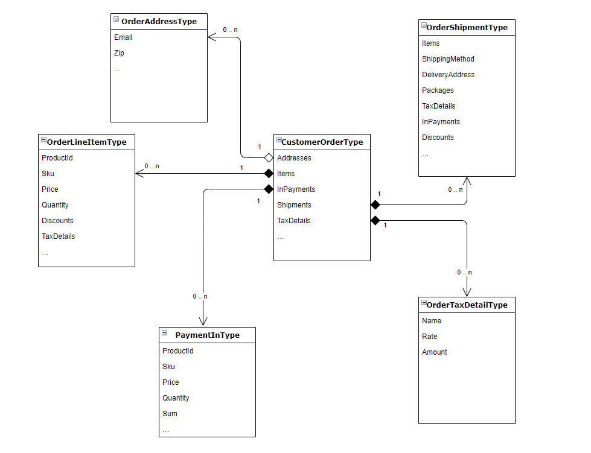

# X-Purchase Order

X-Purchase-Order provides high performance API for order data.

## Key features

- Getting and searching orders;
- Basic order workflow operations;

## QueryRoot
### Queries

|#|Endpoint|Arguments|Returns|
|------|---------|---------|---------|
|1|[order](#order-query)|`id` `number` `userId`|Order|
|2|[orders](#orders-connection)|`filter` `sort` `language` `userId`|Paginated order list|

### Mutations

|# |Endpoint|Arguments|Description|
|--|-----------------------|---------------------|---------|
|1 |[createOrderFromCart](#createOrderFromCart)|`!cartId`|Create order from an existing cart.|
|2 |[changeOrderStatus](#changeOrderStatus)|`!orderId` `!status`|Changes order status.|
|3 |[confirmOrderPayment](#confirmOrderPayment)|`payment { id sum caurrency …}`|Confirms order payment.|
|4 |[cancelOrderPayment](#cancelOrderPayment)|`payment { id sum caurrency …}`|Cancels order payment.|
|5 |[updateOrderDynamicProperties](#updateOrderDynamicProperties)|`!dynamicProperties`|Updates dynamic properties in order.|
|6 |[updateOrderItemDynamicProperties](#updateOrderItemDynamicProperties)|`!lineItemId` `!dynamicProperties`|Updates dynamic properties in order items.|
|7 |[updateOrderShipmentDynamicProperties](#updateOrderShipmentDynamicProperties)|`!shipmentId` `!dynamicProperties`|Updates dynamic properties in order shipment.|
|8 |[updateOrderPaymentDynamicProperties](#updateOrderPaymentDynamicProperties)|`!paymentId` `!dynamicProperties`|Updates dynamic properties in order payment.|
|9 |[initializePayment](#initializePayment)|`orderId` `!paymentId`|Initiates payment processing
|10|[authorizePayment](#authorizePayment)|`orderId` `!paymentId` `parameters { key value }`|Finalizes first step of the payment processing
|11|[addOrUpdateOrderPayment](#addOrUpdateOrderPayment)|`!orderId` `!payment` ([type](https://github.com/VirtoCommerce/vc-module-experience-api/blob/dev/src/XPurchase/VirtoCommerce.ExperienceApiModule.XOrder/Schemas/InputOrderPaymentType.cs))|Add or update payment for order.|

> [!NOTE]
> In arguments column we show additional arguments. if they are marked with an exclamation mark, they are required.

## Queriable objects
### Order main types schema



## Examples

In this block you can find some examples of queries and mutations.

### Order query

```
{
  order(
    number: "CU1508131823002"
    userId: "0cda0396-43fe-4034-a20e-d0bab4c88c93"
  ) {
    id
    customerId
    customerName
    createdDate
    dynamicProperties { name value valueType }
    addresses {
      postalCode
    }
    currency {
      code
    }
    items {
      sku
      name
      quantity
    }
    total {
      amount
    }
    cancelledDate
  }
}
```

<details>
<summary>Example result (click to expand)</summary>

```
{
  "data": {
    "order": {
      "id": "9d27c868-2e31-4ab4-861b-909bc3f86657",
      "customerId": "0cda0396-43fe-4034-a20e-d0bab4c88c93",
      "customerName": "George Basker",
      "createdDate": "2019-01-06",
      "addresses": [
        {
          "postalCode": "77462"
        }
      ],
      "currency": {
        "code": "EUR"
      },
      "items": [
        {
          "sku": "PTO-38363811",
          "name": "Laced In Love White Floral Prom Dress",
          "quantity": 1
        },
        {
          "sku": "QRY-61202734",
          "name": "Dark Blue Floral Print Twist Cut Out Back Dress",
          "quantity": 1
        }
      ],
      "total": {
        "amount": 62.99
      },
      "cancelledDate": null
    }
  },
  "extensions": {}
}
```
</details>

</p>
> [!TIP]
> See OrderType schema for better understanding of possible fields in request.

### Orders connection
With this connection you can get all user's orders.
```
{
  orders(
    after: "0"
    first: 10
    sort: "createdDate:desc"
    language: "en-US"
    userId: "0cda0396-43fe-4034-a20e-d0bab4c88c93"
  ) {
    totalCount
    items {
      id
      customerId
      customerName
      createdDate
      addresses {
        postalCode
      }
      currency {
        code
      }
      items {
        sku
        name
        quantity
      }
      total {
        amount
      }
      cancelledDate
    }
  }
}

```
<details>
<summary>Example result (click to expand)</summary>

```
{
  "data": {
    "orders": {
      "totalCount": 3,
      "items": [
        {
          "id": "11a6d4a0-284f-46b1-8e17-add55983353f",
          "customerId": "0cda0396-43fe-4034-a20e-d0bab4c88c93",
          "customerName": "George Basker",
          "createdDate": "2019-01-06",
          "addresses": [
            {
              "postalCode": "77462"
            }
          ],
          "currency": {
            "code": "EUR"
          },
          "items": [
            {
              "sku": "PTO-38363811",
              "name": "Laced In Love White Floral Prom Dress",
              "quantity": 1
            },
            {
              "sku": "EIQ-20582301",
              "name": "Burgundy Baroque Lace Waist Dress",
              "quantity": 2
            },
            {
              "sku": "334713255",
              "name": "Wide Fit Lilac Ankle Strap Straw Wedges",
              "quantity": 1
            }
          ],
          "total": {
            "amount": 106.98
          },
          "cancelledDate": null
        }
      ]
    }
  },
  "extensions": {}
}
```
</details>

</p>

### Organization orders connection
With this connection you can get all organization's orders.
```
{
  organizationOrders(
    first: 10
    after: "0"
    organizationId: "33ae18d0-b7ba-4844-8c19-afd49489401b"
    sort: "createdDate:desc"
    cultureName: "en-US"
  ) {
    totalCount
    items {
      id
      customerId
      customerName
      createdDate
      addresses {
        postalCode
      }
      currency {
        code
      }
      items {
        sku
        name
        quantity
      }
      total {
        amount
      }
      cancelledDate
    }
  }
}

```
<details>
<summary>Example result (click to expand)</summary>

```
{
  "data": {
    "organizationOrders": {
      "totalCount": 2,
      "items": [
        {
          "id": "f59c58f0-167f-48e4-8dfc-2180c63b674a",
          "customerId": "01b2a227-4256-4b78-a08c-6262ff6c8f5f",
          "customerName": "Stan One",
          "createdDate": "2023-06-14T10:53:20.303895",
          "addresses": [],
          "currency": {
            "code": "USD"
          },
          "items": [
            {
              "sku": "53MF87",
              "name": "Stainless Steel Carriage Bolt, 18-8, NL-19(SM) Finish, 20 DiaThread Size, 50 PK",
              "quantity": 1
            }
          ],
          "total": {
            "amount": 125
          },
          "cancelledDate": null
        },
        {
          "id": "66389b4a-6694-4329-8d2b-2d8f4f1d7837",
          "customerId": "18bcd271-4ef3-463e-82c0-f310256fa7ee",
          "customerName": "Adam Brock",
          "createdDate": "2023-06-14T10:48:01.9463786",
          "addresses": [],
          "currency": {
            "code": "USD"
          },
          "items": [
            {
              "sku": "53MF87",
              "name": "Stainless Steel Carriage Bolt, 18-8, NL-19(SM) Finish, 20 DiaThread Size, 50 PK",
              "quantity": 1
            }
          ],
          "total": {
            "amount": 125
          },
          "cancelledDate": null
        }
      ]
    }
  }
}
```
</details>

</p>

### CreateOrderFromCart

This mutation creates an order from the cart with given id.

#### Query

```
mutation {
  createOrderFromCart(
    command: { cartId: "05479fa6-9b6f-4028-94b1-cda21447e268" }
  )
  {
    id
    items {
      id
      sku
      name
    }
    total {
      amount
    }
  }
}
```
### ChangeOrderStatus

This mutation changes order status.

#### Query

```
mutation {
  changeOrderStatus(
    command: { orderId: "1672428e-52fe-4092-8380-7604c3637f91" status: "Approved"}
  )
}

```

### ConfirmOrderPayment

This mutation confirms order payment.

#### Query

```
mutation {
  confirmOrderPayment(
    command: {
      payment: {
        orderId: "9d27c868-2e31-4ab4-861b-909bc3f86657"
        operationType: "PaymentIn"
        number: "PA1508131823002"
        isApproved: false
        status: "Authorized"
        comment: null
        isCancelled: false
        customerId: "0cda0396-43fe-4034-a20e-d0bab4c88c93"
        sum: 100
        currency: "USD"
        taxDetails: { name: "State tax", amount: 10, rate: 0.1 }
        taxTotal: 10
        discounts: { discountAmount: 11, discountAmountWithTax: 11, currency: "USD" }
      }
    }
  )
}

```

### CancelOrderPayment

This mutation cancels order payment.

#### Query

```
mutation {
  cancelOrderPayment(
    command: {
      payment: {
        orderId: "9d27c868-2e31-4ab4-861b-909bc3f86657"
        operationType: "PaymentIn"
        number: "PA1508131823002"
        isApproved: false
        status: "Authorized"
        comment: null
        isCancelled: false
        customerId: "0cda0396-43fe-4034-a20e-d0bab4c88c93"
        sum: 100
        currency: "USD"
        taxDetails: { name: "State tax", amount: 10, rate: 0.1 }
        taxTotal: 10
        discounts: { discountAmount: 11, discountAmountWithTax: 11, currency: "USD" }
      }
    }
  )
}

```

### updateOrderDynamicProperties

This mutation updates dynamic properties in order

#### Query

```
mutation ($command: InputUpdateOrderDynamicPropertiesType!)
{
    updateOrderDynamicProperties(command: $command)
    {
        dynamicProperties
        {
            name
            value
            valueType
            dictionaryItem
            {
                label
                name
                id
            }
        }
    }
}
```

#### Variables

```
"command": {
    "orderId": "d548c750-5a74-4e54-b72b-f5209f44caa6",
    "dynamicProperties": [
        {
            "name": "Example string property",
            "value": "12345678"
        },
        {
            "name": "Example multilanguage property",
            "locale":"de-DE",
            "value": "hallo welt"
        },
        {
            "name": "Example dictionary property",
            "value": "578fadeb1d2a40b3b08b1daf8db09463"
        }
  	]
  }
}
```

### updateOrderItemDynamicProperties

This mutation updates dynamic properties in order item

#### Query

```
mutation ($command: InputUpdateOrderItemDynamicPropertiesType!)
{
    updateOrderItemDynamicProperties(command: $command)
    {
        items
        {
            id
            dynamicProperties
            {
                name
                value
                valueType
                dictionaryItem
                {
                    label
                    name
                    id
                }
            }
        }
    }
}
```

#### Variables

```
"command": {
    "orderId": "d548c750-5a74-4e54-b72b-f5209f44caa6",
    "lineItemId": "dab09410-aa1a-4daf-8a32-4e41abee77b8",
    "dynamicProperties": [
        {
            "name": "Example string property",
            "value": "12345678"
        },
        {
            "name": "Example multilanguage property",
            "locale":"de-DE",
            "value": "hallo welt"
        },
        {
            "name": "Example dictionary property",
            "value": "578fadeb1d2a40b3b08b1daf8db09463"
        }
  	]
  }
}
```

### updateOrderShipmentDynamicProperties

This mutation updates dynamic properties in order shipment

#### Query

```
mutation ($command: InputUpdateOrderShipmentDynamicPropertiesType!)
{
    updateOrderShipmentDynamicProperties(command: $command)
    {
        shipments
        {
            id
            dynamicProperties
            {
                name
                value
                valueType
                dictionaryItem
                {
                    label
                    name
                    id
                }
            }
        }
    }
}
```

#### Variables:

```
"command": {
    "orderId": "d548c750-5a74-4e54-b72b-f5209f44caa6",
    "shipmentId": "79b8f095-9740-4353-998b-e1c4dd577ee6",
    "dynamicProperties": [
        {
            "name": "Example string property",
            "value": "12345678"
        },
        {
            "name": "Example multilanguage property",
            "locale":"de-DE",
            "value": "hallo welt"
        },
        {
            "name": "Example dictionary property",
            "value": "578fadeb1d2a40b3b08b1daf8db09463"
        }
  	]
  }
}
```

### updateOrderPaymentDynamicProperties

This mutation updates dynamic properties in order payment

#### Query

```
mutation ($command: InputUpdateOrderPaymentDynamicPropertiesType!)
{
    updateOrderPaymentDynamicProperties(command: $command)
    {
        inPayments
        {
            id
            dynamicProperties
            {
                name
                value
                valueType
                dictionaryItem
                {
                    label
                    name
                    id
                }
            }
        }
    }
}
```

#### Variables

```
"command": {
    "orderId": "d548c750-5a74-4e54-b72b-f5209f44caa6",
    "paymentId": "0859f1e8-16e8-4924-808b-47e03560085d",
    "dynamicProperties": [
        {
            "name": "Example string property",
            "value": "12345678"
        },
        {
            "name": "Example multilanguage property",
            "locale":"de-DE",
            "value": "hallo welt"
        },
        {
            "name": "Example dictionary property",
            "value": "578fadeb1d2a40b3b08b1daf8db09463"
        }
  	]
  }
}
```

### initializePayment

This mutation initiates payment processing

#### Query

```
mutation ($command: InputInitializePaymentType!)
{
    initializePayment(command: $command)
    {
        isSuccess
        errorMessage
        storeId
        paymentId
        orderId
        orderNumber
        paymentMethodCode
        paymentActionType
        actionRedirectUrl
        publicParameters {
          key
          value
        }
      }
}
```

#### Variables

```
"command": {
    "orderId": "d548c750-5a74-4e54-b72b-f5209f44caa6",
    "paymentId": "0859f1e8-16e8-4924-808b-47e03560085d"
  }
```

### authorizePayment

This mutation finalizes first step of the payment processing

#### Query

```
mutation ($command: InputAuthorizePaymentType!) {
  authorizePayment(command: $command) {
    isSuccess
    errorMessage
  }
}
```

#### Variables

```
"command": {
    "orderId": "d548c750-5a74-4e54-b72b-f5209f44caa6",
    "paymentId": "0859f1e8-16e8-4924-808b-47e03560085d",
    "parameters": [
      {
        key: "key1",
        value: "value1"
      },
      {
        key: "key2",
        value: "value2"
      }
  }
```

### addOrUpdateOrderPayment

This mutation adds or updates payment of the order. This mutation supports partial update, all fields in `command.payment` and `command.payment.billingAddress` are optional. By passing `command.payment.id` the existing payment will be updated.

#### Query

```
mutation addOrUpdateOrderPayment($command: InputAddOrUpdateOrderPaymentType!) {
  addOrUpdateOrderPayment(command: $command) {
        id
        inPayments (first: 10, sort:"ModifiedDate:desc") {
          id
          createdDate
          billingAddress {
            id
            city
            countryCode
            countryName
            email
            firstName
            lastName
            line1
            line2
            middleName
            name
            organization
            phone
            postalCode
            regionId
            regionName
            zip
            addressType
          }
          paymentMethod {
            code
            paymentMethodType
            paymentMethodGroupType
          }
        }
      }
  }

```

#### Variables

```
"command": {
    "orderId": "74d8b492-0bb5-486e-a0e6-0915848a7379",
    "payment": {
        "id": "New-Id-1",
        "paymentGatewayCode": "AuthorizeNetPaymentMethod",          
        "billingAddress": {
            "city": "Test",
            "countryCode": "US",
            "countryName": "US",
            "email": "address@mail.test",
            "firstName": "First test name",
            "id": "KeyTest",
            "key": "KeyTest",
            "lastName": "Last name test",
            "line1": "Address Line 1",
            "line2": "Address line 2",
            "middleName": "Test Middle Name",
            "name": "First name address",
            "organization": "OrganizationTestName",
            "phone": "88005553535",
            "postalCode": "111111",
            "regionId": "Test region",
            "regionName": "Region 15",
            "zip": "13413",
            "addressType": 2
        }
    }
}
```
