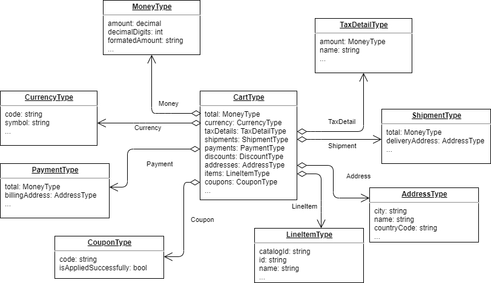

# X-Purchase

## Key features
- Working with shopping cart;
- Auto evaluating taxes and prices;
- Multi-Laguage;
- Multi-Currency;
- Lazy resolving;

## Structure

## Endpoints
### Queries
|№|Endpoint|Arguments|Return|
|------|---------|---------|---------|
|1|[cart](#cart-query)|`storeId` `cartName` `userId` `cultureName` `currencyCode` `type`|Shopping cart|
|2|[carts](#carts-connection)|`storeId` `cartName` `userId` `cultureName` `currencyCode` `cartType` `sort` `skip` `take`|Paginated shopping cart list|
### Mutations
Every mutation contains base arguments for working with cart context:
- `storeId` - Id of current store
- `cartName` - Cart name
- `userId` - Id of current user
- `currency` - Currency code (e.g. "USD")
- `language` - Culture name of current language (e.g. "en-Us")
- `cartType` - Type of cart ("cart" or "whishlist")
#### Mutation list:
|№ |Endpoint|Arguments|Description|
|--|-----------------------|---------------------|---------|
|1 |[addItem](#additem-mutation)|`!productId` `!quantity` `price` `comment`|Add item to cart.|
|2 |[clearCart](#clearcart-mutation)|-|Remove items from cart.|
|3 |[changeComment](#changecomment-mutation)|`comment`|Update cart comment.|
|4 |[changeCartItemPrice](#changecartitemprice-mutation)|`!productId` `!price`|Change cart item price.|
|5 |[changeCartItemQuantity](#changecartitemquantity-mutation)|`!lineItemId` `!quantity`|Change cart item quantity.|
|6 |[changeCartItemComment](#changecartitemcomment-mutation)|`!lineItemId` `comment`|Change cart item comment.|
|7 |[removeCartItem](#removecartitem-mutation)|`!lineItemId`|Remove cart item from cart.|
|8 |[addCoupon](#addcoupon-mutation)|`!couponCode`|Add coupon to cart.|
|9 |[removeCoupon](#removecoupon-mutation)|`couponCode`|Remove coupon from cart. If coupon not passed clear all coupons from cart.|
|10|[removeShipment](#removeshipment-mutation)|`shipmentId`|Remove shipment from cart.|
|11|[addOrUpdateCartShipment](#addorupdatecartshipment-mutation)|`!shipment`([type](https://github.com/VirtoCommerce/vc-module-experience-api/blob/dev/src/XPurchase/VirtoCommerce.XPurchase/Schemas/InputShipmentType.cs))|Add or update shipment for cart.|
|12|[addOrUpdateCartPayment](#addorupdatecartpayment-mutation)|`!payment`([type](https://github.com/VirtoCommerce/vc-module-experience-api/blob/dev/src/XPurchase/VirtoCommerce.XPurchase/Schemas/InputPaymentType.cs))|Add or update payment for cart.|
|13|[validateCoupon](#validatecoupon-mutation)|`!coupon`|Validate coupon, return result.|
|14|[mergeCart](#mergecart-mutation)|`!secondCartId`|Merge two carts into one.|
|15|[removeCart](#removecart-mutation)|`!cartId`|Remove cart.|
|16|[clearShipments](#clearshipments-mutation)|-|Clear cart shipments.|
|17|[clearPayments](#clearpayments-mutation)|-|Clear cart payments.|

> [!NOTE]
> In arguments column we only show additional arguments. if they are marked with an exclamation mark, they are required.

## Examples
In this block you can find some examples of queries and mutations.
### Cart query

```
{
    cart (storeId: "Electronics"
        cartName: "default"
        userId: "d97ee2c7-e29d-440a-a43a-388eb5586087"
        cultureName: "en-Us"
        currencyCode: "USD"
        type: "cart")
    {
        id
        name
        hasPhysicalProducts
        status
        storeId
        isAnonymous
        comment
        taxPercentRate
        taxType
        shipments { shipmentMethodCode shipmentMethodOption }
        availableShippingMethods { code optionName optionDescription }
        discounts { amount description }
        currency { code symbol }
        payments { paymentGatewayCode }
        availablePaymentMethods { code paymentMethodType }
        items { id sku }
        coupons { code isAppliedSuccessfully }
        itemsCount
        itemsQuantity
        type
    }
}
```
> [!TIP]
> See also CartType schema for better understanding of possible fields in request.
### Carts connection
With this connection you can get all user's carts/whishlists.
```
{
    carts (storeId: "Electronics"
        userId: "d97ee2c7-e29d-440a-a43a-388eb5586087"
        cultureName: "en-Us"
        currencyCode: "USD"
        cartType: "cart"
        take: 5
        skip: 0)
    {
        items
        {
            id
            name
            hasPhysicalProducts
            status
            storeId
            isAnonymous
        }
        pageInfo
        {
            startCursor
            endCursor
            hasNextPage
            hasPreviousPage
        }
    }
}
```
### AddItem mutation
This mutation validates item and add it to cart, recalculate promotion rewards and taxes then save cart.
#### Query:
```
mutation ($command:InputAddItemType!)
{
    (command: $command)
    {
        name
        items
        {
            id
            sku
        }
        itemsCount
        itemsQuantity
    }
}
```
#### Variables:
```
"command": {
    "storeId": "Electronics",
    "cartName": "default",
    "userId": "b57d06db-1638-4d37-9734-fd01a9bc59aa",
    "language": "en-US",
    "currency": "USD",
    "cartType": "cart",
    "productId": "9cbd8f316e254a679ba34a900fccb076",
    "quantity": 1
}
```
### ClearCart mutation
This mutation removes all items from cart, reset promotion rewards based on amount of items and save cart.
#### Query:
```
mutation ($command:InputClearCartType!)
{
    (command: $command)
    {
        name
        items
        {
            id
            sku
        }
        itemsCount
        itemsQuantity
    }
}
```
#### Variables:
```
"command": {
    "storeId": "Electronics",
    "cartName": "default",
    "userId": "b57d06db-1638-4d37-9734-fd01a9bc59aa",
    "language": "en-US",
    "currency": "USD",
    "cartType": "cart"
}
```
### ChangeComment mutation
This mutation changes cart comment.
#### Query:
```
mutation ($command:InputChangeCommentType!)
{
    (command: $command)
    {
        name
        comment
    }
}
```
#### Variables:
```
"command": {
    "storeId": "Electronics",
    "cartName": "default",
    "userId": "b57d06db-1638-4d37-9734-fd01a9bc59aa",
    "language": "en-US",
    "currency": "USD",
    "cartType": "cart",
    "comment": "Hi, Virto! :)"
}
```

### ChangeCartItemPrice mutation
This mutation changes cart item price.
#### Query:
```
mutation ($command:InputChangeCartItemPriceType!)
{
    (command: $command)
    {
        id
        items
        {
            sku
            productId
            listPrice
            listPriceWithTax
            salePrice
            salePriceWithTax
        }
    }
}
```
#### Variables:
```
"command": {
    "storeId": "Electronics",
    "cartName": "default",
    "userId": "b57d06db-1638-4d37-9734-fd01a9bc59aa",
    "language": "en-US",
    "currency": "USD",
    "cartType": "cart",
    "productId": "9cbd8f316e254a679ba34a900fccb076",
    "price": 777
}
```

### ChangeCartItemQuantity mutation
This mutation changes cart item quantity.
#### Query:
```
mutation ($command:InputChangeCartItemQuantityType!)
{
    (command: $command)
    {
        id
        items
        {
            sku
            productId
            quantity
        }
        itemsCount
        itemsQuantity
    }
}
```
#### Variables:
```
"command": {
    "storeId": "Electronics",
    "cartName": "default",
    "userId": "b57d06db-1638-4d37-9734-fd01a9bc59aa",
    "language": "en-US",
    "currency": "USD",
    "cartType": "cart",
    "lineItemId": "9cbd8f316e254a679ba34a900fccb076",
    "quantity": 7
}
```

### ChangeCartItemComment mutation
This mutation changes cart item comment.
#### Query:
```
mutation ($command:InputChangeCartItemCommentType!)
{
    (command: $command)
    {
        id
        items
        {
            sku
            productId
            comment
        }
    }
}
```
#### Variables:
```
"command": {
    "storeId": "Electronics",
    "cartName": "default",
    "userId": "b57d06db-1638-4d37-9734-fd01a9bc59aa",
    "language": "en-US",
    "currency": "USD",
    "cartType": "cart",
    "lineItemId": "9cbd8f316e254a679ba34a900fccb076",
    "comment": "nice product"
}
```

### RemoveCartItem mutation
This mutation removes item from cart.
#### Query:
```
mutation ($command:InputRemoveItemType!)
{
    (command: $command)
    {
        id
        items
        {
            sku
            productId
        }
        itemsCount
        itemsQuantity
    }
}
```
#### Variables:
```
"command": {
    "storeId": "Electronics",
    "cartName": "default",
    "userId": "b57d06db-1638-4d37-9734-fd01a9bc59aa",
    "language": "en-US",
    "currency": "USD",
    "cartType": "cart",
    "lineItemId": "9cbd8f316e254a679ba34a900fccb076",
}
```
### AddCoupon mutation
This mutation checks and adds coupon to cart.
#### Query:
```
mutation ($command:InputAddCouponType!)
{
    (command: $command)
    {
        name
        coupons
        {
        	code
            isAppliedSuccessfully
        }
    }
}
```
#### Variables:
```
"command": {
    "storeId": "Electronics",
    "cartName": "default",
    "userId": "b57d06db-1638-4d37-9734-fd01a9bc59aa",
    "language": "en-US",
    "currency": "USD",
    "cartType": "cart",
    "couponCode": "freeItemsCouponCode",
}
```

### RemoveCoupon mutation
This mutation removes coupon from cart.
#### Query:
```
mutation ($command:InputRemoveCouponType!)
{
    (command: $command)
    {
        name
        coupons
        {
        	code
            isAppliedSuccessfully
        }
    }
}
```
#### Variables:
```
"command": {
    "storeId": "Electronics",
    "cartName": "default",
    "userId": "b57d06db-1638-4d37-9734-fd01a9bc59aa",
    "language": "en-US",
    "currency": "USD",
    "cartType": "cart",
    "couponCode": "freeItemsCouponCode",
}
```

### RemoveShipment mutation
This mutation removes shipment from cart.
#### Query:
```
mutation ($command:InputRemoveShipmentType!)
{
    (command: $command)
    {
        name
        availableShippingMethods
        {
          code
          optionName
          optionDescription
        }
    }
}
```
#### Variables:
```
"command": {
    "storeId": "Electronics",
    "cartName": "default",
    "userId": "b57d06db-1638-4d37-9734-fd01a9bc59aa",
    "language": "en-US",
    "currency": "USD",
    "cartType": "cart",
    "shipmentId": "7777-7777-7777-7777",
}
```

### AddOrUpdateCartShipment mutation
This mutation adds or updates shipment of cart.
#### Query:
```
mutation ($command:InputAddOrUpdateCartShipmentType!)
{
    (command: $command)
    {
        name
        availableShippingMethods
        {
          code
          optionName
          optionDescription
        }
    }
}
```
#### Variables:
```
"command": {
    "storeId": "Electronics",
    "cartName": "default",
    "userId": "b57d06db-1638-4d37-9734-fd01a9bc59aa",
    "language": "en-US",
    "currency": "USD",
    "cartType": "cart",
    "shipment": {
        "fulfillmentCenterId": "7777-7777-7777-7777",
        "height": 7,
        "shipmentMethodCode": "code",
        "currency": "USD",
        "price": 98
    },
}
```

> [!TIP]
> To see all possible parametrs for shipment object [look here...](https://github.com/VirtoCommerce/vc-module-experience-api/blob/dev/src/XPurchase/VirtoCommerce.XPurchase/Schemas/InputShipmentType.cs)

### AddOrUpdateCartPayment mutation
This mutation adds or updates payment of cart.
#### Query:
```
mutation ($command:InputAddOrUpdateCartPaymentType!)
{
    (command: $command)
    {
        name
        availablePaymentMethods
        {
          code
          name
          paymentMethodType
        }
    }
}
```
#### Variables:
```
"command": {
    "storeId": "Electronics",
    "cartName": "default",
    "userId": "b57d06db-1638-4d37-9734-fd01a9bc59aa",
    "language": "en-US",
    "currency": "USD",
    "cartType": "cart",
    "payment": {
        "outerId": "7777-7777-7777-7777",
        "paymentGatewayCode": "code",
        "currency": "USD",
        "price": 98,
        "amount": 55
    },
}
```
> [!TIP]
> To see all possible parametrs for payment object [look here...](https://github.com/VirtoCommerce/vc-module-experience-api/blob/dev/src/XPurchase/VirtoCommerce.XPurchase/Schemas/InputPaymentType.cs)

### ValidateCoupon mutation
This mutation validates coupon.
#### Query:
```
mutation ($command:InputValidateCouponType!)
{
    (command: $command)
}
```
#### Variables:
```
"command": {
    "storeId": "Electronics",
    "cartName": "default",
    "userId": "b57d06db-1638-4d37-9734-fd01a9bc59aa",
    "language": "en-US",
    "currency": "USD",
    "cartType": "cart",
    "coupon": {
        "code": "freeItemsCouponCode"
    },
}
```

### MergeCart mutation
This mutation merges two carts. You can use it to merge anonymous cart with user cart after authorization.
#### Query:
```
mutation ($command:InputMergeCartType!)
{
    (command: $command)
    {
        id
        isAnonymous
    }
}
```
#### Variables:
```
"command": {
    "storeId": "Electronics",
    "cartName": "default",
    "userId": "b57d06db-1638-4d37-9734-fd01a9bc59aa",
    "language": "en-US",
    "currency": "USD",
    "cartType": "cart",
    "secondCartId": "7777-7777-7777-7777",
}
```

### RemoveCart mutation
This mutation removes cart.

#### Query:
```
mutation ($command:InputRemoveCartType!)
{
    (command: $command)
}
```
#### Variables:
```
"command": {
    "cartId": "7777-7777-7777-7777"
}
```

### ClearShipments mutation
This mutation removes all shipments from cart.

#### Query:
```
mutation ($command:InputClearShipmentsType!)
{
    (command: $command)
    {
        name
        availableShippingMethods
        {
          code
          optionName
          optionDescription
        }
    }
}
```
#### Variables:
```
"command": {
    "storeId": "Electronics",
    "cartName": "default",
    "userId": "b57d06db-1638-4d37-9734-fd01a9bc59aa",
    "language": "en-US",
    "currency": "USD",
    "cartType": "cart"
}
```

### ClearPayments mutation
This mutation removes all payments from cart.

#### Query:
```
mutation ($command:InputClearPaymentsType!)
{
    (command: $command)
    {
        name
        availablePaymentMethods
        {
          code
          name
          paymentMethodType
        }
    }
}
```
#### Variables:
```
"command": {
    "storeId": "Electronics",
    "cartName": "default",
    "userId": "b57d06db-1638-4d37-9734-fd01a9bc59aa",
    "language": "en-US",
    "currency": "USD",
    "cartType": "cart"
}
```
